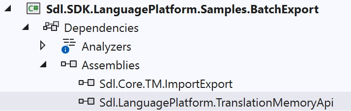

Setting up the Project
======
In this chapter you will learn how to develop a simple command-line application for batch exporting numerous *.sdltm files in <var:VisualStudioEdition> using C#.

Start by creating a new Console Application called Sdl.**SDK.LanguagePlatform.Samples.BatchExport**.

The project requires the following references:

* Sdl.Core.TM.ImportExport
* Sdl.LanguagePlatform.TranslationMemoryApi

The classes in your project should use the following namespaces:

* System.IO
* System.Globalization
* Sdl.LanguagePlatform.TranslationMemoryApi

See Also
--
[Looping through the Folder(s)](looping_through_the_folder.md)

[Exporting to TMX](exporting_to_tmx.md)