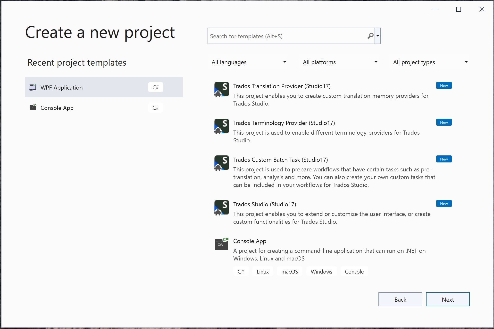
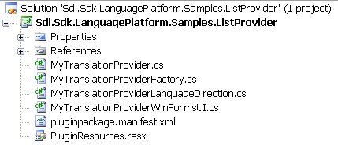
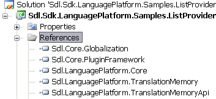

# Setting up the Project

To implement a custom translation provider plug-in, create a new class library project in Var:VisualStudioEdition.

## Install the SDK on your development machine

Before you develop plug-ins for Var:ProductName, make sure that the SDK is installed on your development machine. The SDK installer adds new templates to your Var:VisualStudioEdition environment, as shown in the screenshot below. For the plug-in type covered in this chapter, choose **Translation Provider Plug-in**.

Please also refer to [Setting up a Development Machine](../../articles/gettingstarted/setting_up_a_developer_machine.md).

## Set up your translation provider plug-in project

Start by creating a new project in Var:VisualStudioEdition. In the **New Project** dialog box, select the **Translation Provider Plug-in** template and rename the project to **Sdk.LanguagePlatform.Samples.ListProvider**:



The template provides the minimum code, or stubs, that you need to build a valid translation provider. The stubs do not include the application logic. The following items are included by default in the project:



Your implementation might require additional classes, such as a form for the user interface that configures plug-in settings. For example, when file TMs are selected for a project, a dialog box lets users choose the TM files. In this implementation, users select the delimited list file and enter the delimiter character. See also [Implementing the Plug-in User Interface](implementing_the_plugin_user_interface.md).

In addition to the stubs, the project template includes the required references listed below:

* Sdl.Core.PluginFramework
* Sdl.LanguagePlatform.Core
* Sdl.LanguagePlatform.TranslationMemory
* Sdl.LanguagePlatform.TranslationMemoryApi



> [!NOTE]
>
> The **PluginProperties** class file in the **Properties** subfolder contains a string value named **Plugin_Name**. This plug-in attribute marks the project as a plug-in project. **Plugin_Name** is a resource string defined in **PluginResources.resx**, which is also part of the template. See also [The Resources File](the_resources_file.md).

# [C#](#tab/tabid-1)
```cs
using Sdl.Core.PluginFramework;

// TODO: edit the Plugin_Name string in  PluginResources.resx to change the name of your plug-in
[assembly: Plugin("Plugin_Name")]
```
***
