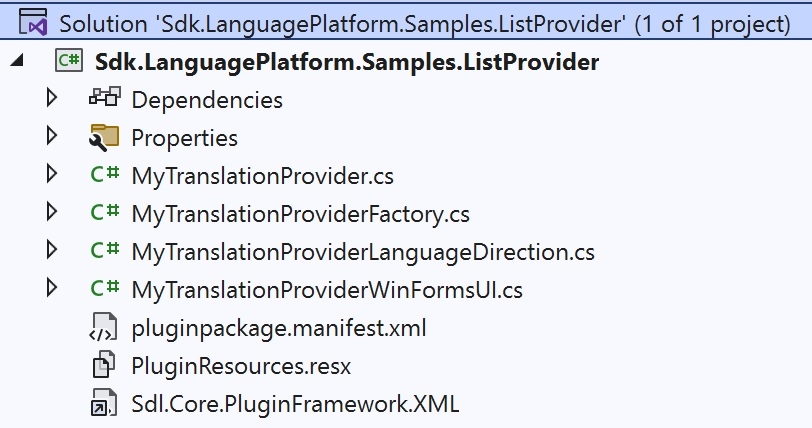

Setting up the Project
=====
To implement a custom translation provider plug-in, create a new class library project in <var:VisualStudioEdition>.

Install the SDK on your Development Machine
----
Before you start developing plug-ins for <Var:ProductName>, you should make sure that the SDL SDK is installed on your development PC. The SDK installer will add new templates to your <var:VisualStudioEdition> environment, as illustrated in the screenshot below. For the type of plug-in discussed in this chapter, we require the **Translation Provider Plug-in** type.

Please also refer to [Setting up a Development Machine](../../articles/gettingstarted/setting_up_a_developer_machine.md).

Set up your Translation Provider Plug-in Project
----
Start by creating a new project in <var:VisualStudioEdition>. In the **New Project** dialog box select the **Translation Provider Plug-in** template. Rename the project to **Sdl.Sdk.LanguagePlatform.Samples.ListProvider**:


Leveraging the template makes sure that your project contains the minimum amount of code (i.e. the stubs) that is required for building a valid translation provider. Of course, the stubs will not contain any of the required application logic. Below you see the items that are by default included in the project:



Your implementation might require additional classes, e.g. a form for implementing a user interface through which you configure any plug-in settings. (When file TMs, for example, are selected for a project, a dialog box is raised to allow users to select the TM files.) In our implementation, we will require a form in which users can select the delimited list file and enter the delimiter character. (See also [Implementing the Plug-in User Interface](implementing_the_plugin_user_interface.md)).

Apart from the stubs, the project template will also contain the required references, which are listed below:

* Sdl.Core.PluginFramework
* Sdl.LanguagePlatform.Core
* Sdl.LanguagePlatform.TranslationMemory
* Sdl.LanguagePlatform.TranslationMemoryApi


> [!NOTE]
>
> The line in the **PluginProperties** class file in the **Properties** sub-folder. You will see that this file contains a string value called **Plugin_Name**. This single plug-in attribute is what fundamentally makes this project a plug-in project. **Plugin_Name** is a resource string defined in **PluginResources.resx**, which is also part of the template. (See also [The Resources File](the_resources_file.md)).

# [C#](#tab/tabid-1)
```cs
using Sdl.Core.PluginFramework;

// TODO: edit the Plugin_Name string in  PluginResources.resx to change the name of your plug-in
[assembly: Plugin("Plugin_Name")]
```
***