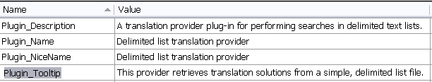

# The Resources File

The resources file contains the strings and elements that users see in the user interface of Var:ProductName, such as the plug-in name, icon, and description.

The **PluginResources.resx** file is one of the components provided by the project template. It contains a string named **Plugin_Name**, which defines the plug-in assembly name and defaults to the Visual Studio project name. This name appears in the Var:ProductName plug-in management dialog.

Define any localizable strings referenced by the plug-in attribute or extension attributes in **PluginResources.resx**. During build, the **.resx** file is compiled into a **.resources** file and deployed outside the plug-in assembly, so the host application can access the information without loading the assembly.

The resources file for this project should look as shown below:

The string resources serve these purposes:

* **Plugin_Name** appears in the **Plug-ins** dialog box of Var:ProductName, which end users open only occasionally.
* **Plugin_NiceName** appears in the Var:ProductName user interface when users select a translation provider.
* **Plugin_Tooltip** appears when users move the mouse pointer over the plug-in name or icon.
* **Plugin_Description** contains additional descriptive information about the plug-in.

> [!NOTE]
> 
> **Plugin_Description** is currently not supported. Although you can specify it, Var:ProductName does not display a plug-in description.

In this implementation, we also add an icon file (*band_aid.ico*) to the resources. Var:ProductName displays the icon in the user interface, which makes the plug-in easier to recognize.

The screenshot below shows how the plug-in appears in the Var:ProductName UI after the user selects it as a provider for a translation project:

Similarly, add a *.png* file named *band_aid.png* to the resources. Var:ProductName displays this image when a match is found in the translation provider, which helps users distinguish your implementation from other translation providers.

The screenshot below shows how Var:ProductName displays a match from your translation provider, including the plug-in graphic and name:

> [!NOTE]
> 
> We recommend using an image with a transparent background for your plug-in.

# See Also
[Controlling the Plug-in User Interface](controlling_the_plugin_user_interface.md)

[Instantiating the Plug-in](instantiating_the_plugin.md)
