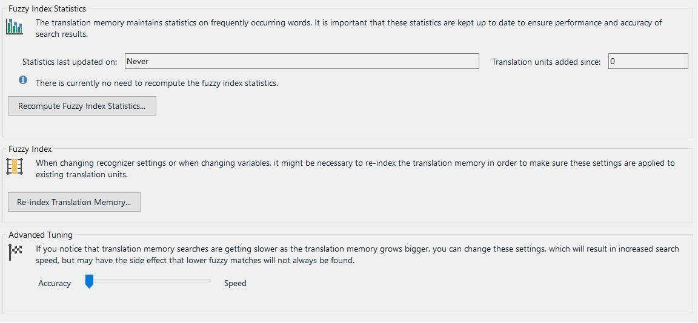

# Tuning and Maintaining a Translation Memory

Translation memory databases need regular tuning and maintenance as they grow. You may want to automate these tasks, for example by running a scheduled job at regular intervals.

## About TM Tuning

In Var:ProductName, the tuning options look like this:



The most common tuning operation is recomputing the fuzzy index. As the TM grows, more units are added to the database. To keep the fuzzy index efficient, recompute it at regular intervals, depending on how quickly your TM grows. This helps balance speed and match quality. Through the API, you can determine when the fuzzy index was last recomputed and whether recomputation is recommended, and then trigger the operation programmatically.

There is also a trade-off between speed and accuracy. Increasing search speed can reduce the number of lower fuzzy matches that you retrieve. If your TM grows large, for example beyond 200,000 units, and lookups become slow, you may want to optimize the TM for speed. That may mean that some lower fuzzy matches are no longer returned.

Through the API, you can run scheduled scripts that recompute the fuzzy index regularly and keep your TMs efficient.

## Add a New Tuning Class

Start by adding a new class named `TmTuner` to your project. Then implement a public method named `TuneTm()` that takes the TM path as a string parameter. Call it as shown below:

# [C#](#tab/tabid-1)
```cs
var tuner = new TmTuner();
tuner.TuneTm(_translationMemoryFilePath);
```
***

Use the `TuneTm()` method to recompute the fuzzy index and optimize the TM for speed through the [RecomputeFuzzyIndexStatistics](../../api/translationmemory/Sdl.LanguagePlatform.TranslationMemoryApi.AbstractLocalTranslationMemory.yml#Sdl_LanguagePlatform_TranslationMemoryApi_AbstractLocalTranslationMemory_RecomputeFuzzyIndexStatistics) method, as shown below:

# [C#](#tab/tabid-2)
```cs
var tm = new FileBasedTranslationMemory(tmPath);

tm.RecomputeFuzzyIndexStatistics();
tm.Save();
```
***

Calling [RecomputeFuzzyIndexStatistics](../../api/translationmemory/Sdl.LanguagePlatform.TranslationMemoryApi.AbstractLocalTranslationMemory.yml#Sdl_LanguagePlatform_TranslationMemoryApi_AbstractLocalTranslationMemory_RecomputeFuzzyIndexStatistics) on the current TM starts the recomputation process. Depending on the TM size, this may take some time. The **MinScoreIncrease** property can be set between 0 and 20. A value of 20 optimizes the TM for speed by internally adding up to 20 percentage points to the minimum match score configured in the application. For example, if you set the minimum score increase to 10, a 70% fuzzy match may be treated as 80%, which means the 70% match is no longer returned. In return, lookup speed improves because the TM can limit searches to higher fuzzy scores. The lower the fuzzy value, the slower the search, because the system must evaluate more differences. After tuning the TM, call `Save()`.


The TM API also lets you determine when the fuzzy index was last recomputed and whether recomputation is recommended. You can use this information to trigger recomputation automatically when needed.

# [C#](#tab/tabid-3)
```cs
string stats;
stats = "Fuzzy index last recomputed at: " + tm.FuzzyIndexStatisticsRecomputedAt.Value.ToString();
stats += "; Fuzzy index needs to be recomputed: " + tm.ShouldRecomputeFuzzyIndexStatistics().ToString();

MessageBox.Show(stats);
```
***

## Putting it All Together

Your complete class should now look like this:

# [C#](#tab/tabid-4)
```cs
namespace SDK.LanguagePlatform.Samples.TmAutomation
{
    using System.Windows.Forms;
    using Sdl.LanguagePlatform.TranslationMemoryApi;

    public class TmTuner
    {
        public void TuneTm(string tmPath)
        {
            #region "tune"
            var tm = new FileBasedTranslationMemory(tmPath);

            tm.RecomputeFuzzyIndexStatistics();
            tm.Save();
            #endregion

            #region "stats"
            string stats;
            stats = "Fuzzy index last recomputed at: " + tm.FuzzyIndexStatisticsRecomputedAt.Value.ToString();
            stats += "; Fuzzy index needs to be recomputed: " + tm.ShouldRecomputeFuzzyIndexStatistics().ToString();

            MessageBox.Show(stats);
            #endregion
        }
    }
}
```
***

## See Also
[Maintaining Translation Memories](maintaining_translation_memories.md)

