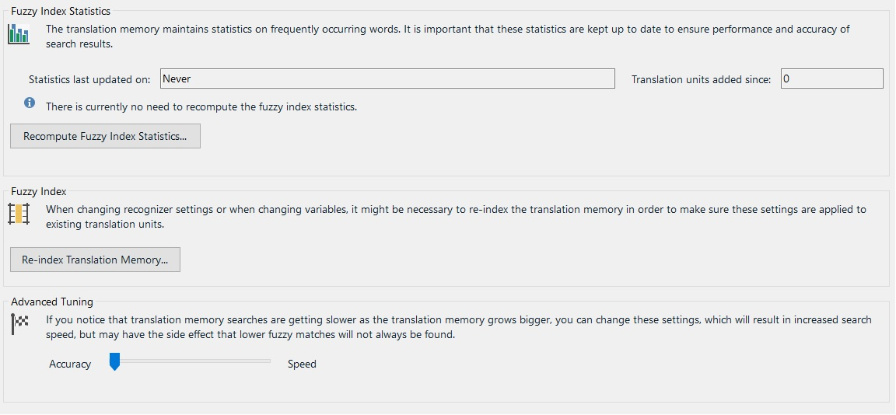

Tuning and Maintaining a Translation Memory
==

Translation memory databases need to be tuned and maintained from time to time as they are growing. This is a task that may potentially require automation, e.g. if you want to develop a scheduled task that performs a tuning operation on a TM at regular intervals.

About TM Tuning
In <Var:ProductName>, the tuning options look as shown in the screenshot below:



Probably the most common tuning operation is the recomputation of the fuzzy index. As the TM grows more and more units get added to the database. To keep the fuzzy index lean and efficient, you should recompute the index at regular intervals, depending on how fast your TM grows. This ensures speed and accuracy of the TM. Through the API you can determine when the fuzzy index was last recomputed and whether recomputing is required / recommended. Based on this information you could then trigger an action to recompute the fuzzy index programmatically.

Moreover, there is a trade-off between accuracy and speed. This means that you may increase the search speed at the price of not retrieving certain lower fuzzy matches. On the other hand, you may want to get more low fuzzy matches at the price of slower TM lookups. For example, if your TM has become rather big (e.g. more than 200,000 units), and users are reporting that TM lookup operations have become slow, you may want to optimize the TM for speed. To be sure, this might mean that certain lower fuzzy matches will no longer be offered. On the other hand, in a big TM the likelihood of finding solutions is, of course, much bigger than in small TMs.

Through the API you can, for example, run scheduled scripts that recompute the fuzzy index on a regular basis to make sure that your TMs stay lean and efficient

Add a New Tuning Class
--

Start by adding new class called ```TmTuner``` to your project. Next, implement a public function called ```TuneTm```, which takes the file name and path of the TM that should be tuned as string parameter. This function can be called as shown below:

```cs
TMTuner tuning = new TMTuner();
tuning.TuneTm(_translationMemoryFilePath);
```

We use the ```TuneTm``` function to recompute the fuzzy index and to optimize the TM for speed through the [RecomputeFuzzyIndexStatistics](../../api/translationmemory/Sdl.LanguagePlatform.TranslationMemoryApi.AbstractLocalTranslationMemory.yml#Sdl_LanguagePlatform_TranslationMemoryApi_AbstractLocalTranslationMemory_RecomputeFuzzyIndexStatistics) method as shown in the example below:

```cs
FileBasedTranslationMemory tm = new FileBasedTranslationMemory(tmPath);

tm.RecomputeFuzzyIndexStatistics();
tm.Save();
```

By applying the [RecomputeFuzzyIndexStatistics](../../api/translationmemory/Sdl.LanguagePlatform.TranslationMemoryApi.AbstractLocalTranslationMemory.yml#Sdl_LanguagePlatform_TranslationMemoryApi_AbstractLocalTranslationMemory_RecomputeFuzzyIndexStatistics) method to the current TM you trigger the process that recomputes the index. Depending on the size of the TM this process can take some time. The **MinScoreIncrease** property can be set between 0 and 20. A value of 20 means that that the TM will be optimized for speed. Speeding up TM lookup operations is basically done by internally adding a percentage value between 0 and 20 to the minimum match score set in the application. Example: You have set the minimum score increase value to 10. The TM contains a 70% fuzzy match, which would normally offered to the user, as the default setting of <Var:ProductName> searches for TUs down to a fuzziness level of 70%. However, since the TM has been configured to always internally add a score value of 10, <Var:ProductName> will not go down to a fuzziness level of 70%, but will already stop searching at 80%. This means that the 70% match will not be offered to the user. However, in return, the lookup speed will be improved, as the TM is 'allowed' to limit itself to searches in the higher fuzzy range. Note that the lower the fuzzy value, the slower the search, as more differences need to be identified and computed. After tuning the TM, do not forget to apply the ```Save``` method.


The TM API also allows you to determine when the fuzzy index was last recomputed and whether it is recommended to perform a recomputation. This information can be used, for example, to automatically recompute the fuzzy index when your implementation determines that doing so is recommended.

```cs
string stats;
stats = "Fuzzy index last recomputed at: " + tm.FuzzyIndexStatisticsRecomputedAt.Value.ToString();
stats += "; Fuzzy index needs to be recomuted: " + tm.ShouldRecomputeFuzzyIndexStatistics().ToString();

MessageBox.Show(stats);
```

Putting it All Together
--

Your complete class should now look as shown below:

```cs
namespace Sdl.SDK.LanguagePlatform.Samples.TmAutomation
{
    using System.Windows.Forms;
    using Sdl.LanguagePlatform.TranslationMemoryApi;

    public class TMTuner
    {
        public void TuneTm(string tmPath)
        {
            #region "tune"
            FileBasedTranslationMemory tm = new FileBasedTranslationMemory(tmPath);

            tm.RecomputeFuzzyIndexStatistics();
            tm.Save();
            #endregion

            #region "stats"
            string stats;
            stats = "Fuzzy index last recomputed at: " + tm.FuzzyIndexStatisticsRecomputedAt.Value.ToString();
            stats += "; Fuzzy index needs to be recomuted: " + tm.ShouldRecomputeFuzzyIndexStatistics().ToString();

            MessageBox.Show(stats);
            #endregion
        }
    }
}
```

See Also
--


[Maintaining Translation Memories](maintaining_translation_memories.md)

