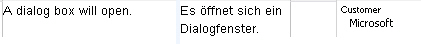
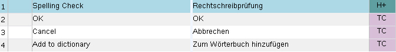

# Updating a Translation Memory

This chapter explains how to add content to a TM. Translators typically add translation units to a TM or edit existing ones by replacing older translations. Updating a TM can also include adding field information, such as project IDs or client names, to translation units. The following examples show how to handle these common editing tasks programmatically.

## Add a New Class

Start by adding a new class named `TmUpdater` to your project.

## Add a Translation Unit

One of the most common tasks is adding new translation units, or TUs, to a TM. This usually happens while translators work segment by segment. In this example, add a simple TU with plain-text segments and a picklist field value, *Customer* = *Microsoft* (see [Adding TM Fields](adding_tm_fields.md)).

Start by implementing a method named `AddTu()` that takes the TM path as a string parameter. Call it as shown below:

# [C#](#tab/tabid-1)
```cs
var tmUpdater = new TmUpdater();
tmUpdater.AddTu(_translationMemoryFilePath);
```
***

After you open the TM, create a TU object:

# [C#](#tab/tabid-2)
```cs
var tm = new FileBasedTranslationMemory(tmPath);

var tu = new TranslationUnit();
```
***

Each TU contains at least a source and a target segment. Create source and target segment objects based on the TM language direction, then add the source and target text. In this example, plain strings are sufficient.

# [C#](#tab/tabid-3)
```cs
tu.SourceSegment = new Segment(tm.LanguageDirection.SourceLanguage);
tu.TargetSegment = new Segment(tm.LanguageDirection.TargetLanguage);

tu.SourceSegment.Add("A dialog box will open.");
tu.TargetSegment.Add("Es öffnet sich ein Dialogfenster.");
```
***

>[!NOTE]
>
>If the source or target text requires tags, such as inline formatting, use an element instead of a simple string.


To add a picklist field value to the TU, create the value object and add it to the TU:

# [C#](#tab/tabid-4)
```cs
var value = new MultiplePicklistFieldValue("Customer");
value.Add("Microsoft");
tu.FieldValues.Add(value);
```
***

Finally, add the TU object to the TM:

# [C#](#tab/tabid-5)
```cs
tm.LanguageDirection.AddTranslationUnit(tu, this.GetImportSettings());
```
***


The [AddTranslationUnit](../../api/translationmemory/Sdl.LanguagePlatform.TranslationMemoryApi.FileBasedTranslationMemoryLanguageDirection.yml#Sdl_LanguagePlatform_TranslationMemoryApi_FileBasedTranslationMemoryLanguageDirection_AddTranslationUnit_Sdl_LanguagePlatform_TranslationMemory_TranslationUnit_Sdl_LanguagePlatform_TranslationMemory_ImportSettings_) method also requires import settings. Adding a single TU is similar to a mini-import. Import settings determine, for example, whether existing TM field values are left unchanged, overwritten, or merged. You can also decide whether to check for sublanguages. For example, if a user adds English (UK) segments to a TM that uses English (US) as the source language, **CheckMatchingSublanguages** determines whether to ignore the sublanguage difference or reject the TU. In this example, the import settings are defined in a separate method and passed to [AddTranslationUnit](../../api/translationmemory/Sdl.LanguagePlatform.TranslationMemoryApi.FileBasedTranslationMemoryLanguageDirection.yml#Sdl_LanguagePlatform_TranslationMemoryApi_FileBasedTranslationMemoryLanguageDirection_AddTranslationUnit_Sdl_LanguagePlatform_TranslationMemory_TranslationUnit_Sdl_LanguagePlatform_TranslationMemory_ImportSettings_):

# [C#](#tab/tabid-6)
```cs
private ImportSettings GetImportSettings()
{
    var settings = new ImportSettings();
    settings.CheckMatchingSublanguages = true;
    settings.ExistingFieldsUpdateMode = ImportSettings.FieldUpdateMode.Merge;

    return settings;
}
```
***

>[!NOTE]
>
>If the same TU already exists, it is not added as a duplicate.

The following screenshot illustrates what the newly added TU will look like in Var:ProductName:



>[!NOTE]
>
>Information such as the creation date and user is added automatically by the API. Your application does not need to set it.

## Add Further Information to the Translation Unit

You can also add other TU information. One example is the confirmation level. TUs can have confirmation levels such as draft, approved, or rejected, which indicate the quality and reliability of a translation. Set the confirmation level through the **TranslationUnitConfirmationLevel** property.

Below is an example of how to set the TU confirmation level to approved:

# [C#](#tab/tabid-7)
```cs
tu.ConfirmationLevel = ConfirmationLevel.ApprovedTranslation;
```
***

Another example is the **TranslationUnitFormat** property, which indicates whether a TU is in the format of Var:ProductName, Translator's Workbench, TTX, and so on. The following example sets the format to Var:ProductName:

# [C#](#tab/tabid-8)
```cs
tu.Format = TranslationUnitFormat.SDLTradosStudio2009;
```
***

TUs may come from interactive translation, machine translation, document alignment, or other sources. If you want to indicate the origin of a TU, set the **TranslationUnitOrigin** property. In the example below, the TU origin is set to *TM*.

# [C#](#tab/tabid-9)
```cs
tu.Origin = TranslationUnitOrigin.TM;
```
***

The full method for adding a TU looks like this:

# [C#](#tab/tabid-10)
```cs
public void AddTu(string tmPath)
{
    #region "open"
    var tm = new FileBasedTranslationMemory(tmPath);

    var tu = new TranslationUnit();
    #endregion

    #region "segments"
    tu.SourceSegment = new Segment(tm.LanguageDirection.SourceLanguage);
    tu.TargetSegment = new Segment(tm.LanguageDirection.TargetLanguage);

    tu.SourceSegment.Add("A dialog box will open.");
    tu.TargetSegment.Add("Es öffnet sich ein Dialogfenster.");
    #endregion

    #region "AddField"
    var value = new MultiplePicklistFieldValue("Customer");
    value.Add("Microsoft");
    tu.FieldValues.Add(value);
    #endregion

    #region "ConfirmationLevel"
    tu.ConfirmationLevel = ConfirmationLevel.ApprovedTranslation;
    #endregion

    #region "format"
    tu.Format = TranslationUnitFormat.SDLTradosStudio2009;
    #endregion

    #region "origin"
    tu.Origin = TranslationUnitOrigin.TM;
    #endregion

    #region "StructureContext"
    tu.StructureContexts = new string[] { "H" };
    #endregion

    #region "AddTu"
    tm.LanguageDirection.AddTranslationUnit(tu, this.GetImportSettings());
    tm.Save();
    MessageBox.Show("TU has been added successfully.");
    #endregion
}
```
***

TUs can also contain structure context information that shows where a segment appeared, for example, in a headline, table cell, or footnote. This information can be useful because the same source segment may need different translations depending on where it appears. Var:ProductName uses display codes such as H (Headline) and FN (Footnote) to show the structure context of a TU.



You can apply structure context information through the **StructureContexts** property as shown below:

# [C#](#tab/tabid-11)
```cs
tu.StructureContexts = new string[] { "H" };
```
***

When you add structure context information to a TU, you can provide an array of strings. A segment can appear in more than one context, for example, in a heading and a footnote.

## Edit a Translation Unit

TUs are often changed when a translator decides that an existing target segment should be updated because the previous translation is incorrect or outdated. The following example shows how to replace the target segment of an existing TU with a new translation.

Start by adding a method named `EditTu()` that takes the TM path as a string parameter. Call it as shown below:

# [C#](#tab/tabid-12)
```cs
var tmUpdater = new TmUpdater();
tmUpdater.AddTu(_translationMemoryFilePath);
tmUpdater.AddTuExtended(_translationMemoryFilePath);
tmUpdater.EditTu(_translationMemoryFilePath);
tmUpdater.DeleteTu(_translationMemoryFilePath);
```
***

This `EditTu()` method simulates a translator looking up *A dialog box will open.* and receiving a 100% match whose original target segment (*Es öffnet sich ein Dialogfenster.*) should be replaced with a new translation, such as *Ein Dialogfeld wird geöffnet.* In this simplified implementation, open the TM, search for the source segment, and move the search settings into a separate helper method, as shown in [Doing Translation Memory Lookups](doing_translation_memory_lookups.md):

# [C#](#tab/tabid-13)
```cs
private SearchSettings GetSearchSettings()
{
    SearchSettings settings = new SearchSettings();
    settings.MinScore = 100;
    return settings;
}
```
***

The search should yield one result (i.e. the previously added TU) that matches our search by 100%. We then clear the existing target segment and replace it with the corrected version as demonstrated in the following code example:

# [C#](#tab/tabid-14)
```cs
public void EditTu(string tmPath)
{
    FileBasedTranslationMemory tm = new FileBasedTranslationMemory(tmPath);

    SearchResults results = tm.LanguageDirection.SearchText(this.GetSearchSettings(), "A dialog box will open.");
    foreach (SearchResult item in results)
    {
        if (item.ScoringResult.Match == 100)
        {
            item.MemoryTranslationUnit.TargetSegment.Clear();
            item.MemoryTranslationUnit.TargetSegment.Add("Ein Dialogfeld wird geöffnet.");
            item.MemoryTranslationUnit.SystemFields.UseCount++;
            break;
        }
    }

    tm.Save();
}
```
***

## Delete a Translation Unit

Another common task is deleting a translation unit because it is outdated or incorrect. Add a method named `DeleteTu()`. As with editing a TU, first perform an exact search for the source segment, then retrieve the TU ID and delete the unit, as shown below:

# [C#](#tab/tabid-15)
```cs
FileBasedTranslationMemory tm = new FileBasedTranslationMemory(tmPath);

SearchResults results = tm.LanguageDirection.SearchText(this.GetSearchSettings(), "A dialog box will open.");
foreach (SearchResult item in results)
{
    if (item.ScoringResult.Match == 100)
    {
        PersistentObjectToken tuId = item.MemoryTranslationUnit.ResourceId;
        tm.LanguageDirection.DeleteTranslationUnit(tuId);
        break;
    }
}
```
***

>[!NOTE]
>
>Each TU possesses a unique id by which it can be identified within the TM.

You can also clear the entire TM by calling `DeleteAllTranslationUnits()`, which removes all translation units stored in the TM.
# [C#](#tab/tabid-16)
```cs
tm.LanguageDirection.DeleteAllTranslationUnits();
```
***

>[!NOTE]
>
>Deleting all TUs in a TM is potentially destructive and should only be done in exceptional cases because the operation cannot be undone.


## See Also
[Updating Translation Memories](updating_translation_memories.md)

[Importing a TMX File](importing_a_tmx_file.md)

