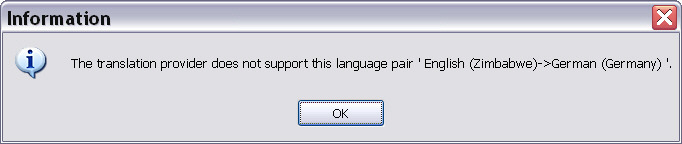

# Verifying the Language Pair Support

A translation provider plug-in should verify that the language pair selected when a document opens, or when a project is created, is supported by the translation provider source. In this sample, the provider uses a delimited text file. For example, if a user selects **Japanese -> French** but the delimited list contains **Italian -> Spanish** segment pairs, reject the file as a translation provider.

## Requirements for Checking the Language Direction in the Sample Implementation

The first line of a delimited text file must contain the language pair. Separate the source and target languages with the delimiter character, for example:

```
en-US;de_DE
```

The sample plug-in first checks whether the first line splits into two values at the delimiter and whether those values match the language pair the user selected in Var:ProductName.

In the screenshot below, English (US) is the source language and German (Germany) is the target language. The API returns `en-US` for `SourceCultureName` and `de-DE` for `TargetCultureName`. Those values match the locale combination in the list file, which makes validation straightforward.


In other implementations, the translation provider may not use a direct language mapping. In those cases, you may need more logic to validate the language combination.

The goal is to confirm that the selected language pair fits the translation provider and that the provider supports the pair at all. For example, if you connect to an automated translation service that does not support Japanese, and the user selects Japanese as the source or target language, show an error message and prevent the user from selecting that provider.

## Implement the Logic for Checking the Language Direction

Implement the language-direction check in the [SupportsLanguageDirection](../../api/translationmemory/Sdl.LanguagePlatform.TranslationMemoryApi.ITranslationProvider.yml#Sdl_LanguagePlatform_TranslationMemoryApi_ITranslationProvider_SupportsLanguageDirection_Sdl_LanguagePlatform_Core_LanguagePair_) method on the [ITranslationProvider](../../api/translationmemory/Sdl.LanguagePlatform.TranslationMemoryApi.ITranslationProvider.yml) interface. The method accepts a region-qualified source-target language pair. Compare that pair with the language direction of the translation provider.

Start by opening the text file and reading the first line:
# [C#](#tab/tabid-1)
```cs
using (StreamReader listFile = new StreamReader(Options.ListFileName))
{
    firstLine = listFile.ReadLine();
    listFile.Close();
}
```
***

Then verify that the first line contains exactly two language values separated by the delimiter. If the line does not split into two values, return `false` and reject the list file as a translation provider.
# [C#](#tab/tabid-2)
```cs
string[] langs = (firstLine.Split(Convert.ToChar(Options.Delimiter)));
if (langs.Count<string>() != 2)
{
    return false;
}
```
***

If the first line contains valid language values, compare the language pair from the file with the source and target languages selected in Var:ProductName. Return `true` when the values match; otherwise return `false`.
# [C#](#tab/tabid-3)
```cs
if (langs[0].ToLower() == languageDirection.SourceCultureName.ToLower()
    && langs[1].ToLower() == languageDirection.TargetCultureName.ToLower())
{
    // The provider supports the selected language direction.
    return true;
}
else
{
    // The provider does not support the selected language direction.
    return false;
}
```
***
When the method returns `false`, Var:ProductName shows a message like the one below when the user selects the translation provider:



## Putting It All Together

The complete method should now look like this:
# [C#](#tab/tabid-4)
```cs
public bool SupportsLanguageDirection(LanguagePair languageDirection)
{
    string firstLine = "";
    
    using (StreamReader listFile = new StreamReader(Options.ListFileName))
    {
        firstLine = listFile.ReadLine();
        listFile.Close();
    }
    
    // Check whether the first line of the text file indicates
    // the language direction, e.g. en-US;de-DE.
    // If the first line cannot be split at the delimiter, the delimited list
    // file should not be accepted as translation provider.
    string[] langs = (firstLine.Split(Convert.ToChar(Options.Delimiter)));
    if (langs.Count<string>() != 2)
    {
        return false;
    }

    // This implementation will not be case-sensitive, therefore
    // we use the ToLower() method when comparing the language direction
    // of the delimited file to the language direction that was
    // selected in Trados Studio.
    if (langs[0].ToLower() == languageDirection.SourceCultureName.ToLower()
        && langs[1].ToLower() == languageDirection.TargetCultureName.ToLower())
    {
        // The provider supports the selected language direction.
        return true;
    }
    else
    {
        // The provider does not support the selected language direction.
        return false;
    }
}
```
***
