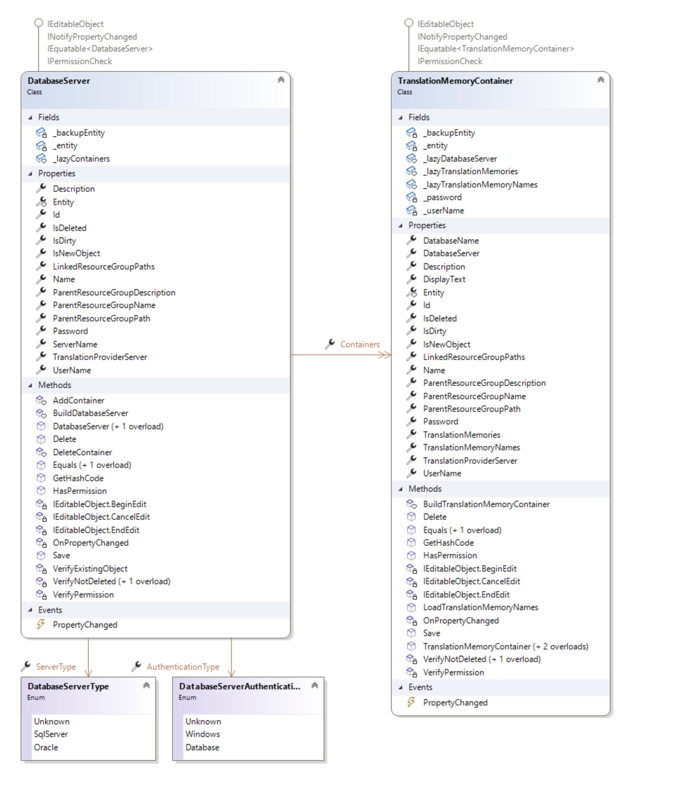

Working with Database Servers and Containers
=====
This section describes how to work with database servers and translation memory containers.

Overview
------
All server-based translation memories reside in a database that is typically seperate from the main TM server database. Such a database is called a translation memory container. TM Server supports spreading the server-based translation memories in the system across multiple translation memory containers.

The API uses the following two classes to model these concepts:

* **[DatabaseServer](../../api/translationmemory/Sdl.LanguagePlatform.TranslationMemoryApi.DatabaseServer.yml)**: A database server that hosts one or more translation memory containers. In order to use a database server for hosting translation memory containers, it has to be registered with the system. See [Registering a Database Server](#registering-a-database-server).
* **[TranslationMemoryContainer](../../api/translationmemory/Sdl.LanguagePlatform.TranslationMemoryApi.TranslationMemoryContainer.yml)**: A translation memory container is a database that is hosted on one of the registered database servers. Every container can host one or more server-based translation memories ([ServerBasedTranslationMemory](../../api/translationmemory/Sdl.LanguagePlatform.TranslationMemoryApi.ServerBasedTranslationMemory.yml)). See [Creating a Translation Memory Container](#creating-a-translation-memory-container):

Registering a Database Server
-----
In order to register a database server with TM Server, create a new [DatabaseServer](../../api/translationmemory/Sdl.LanguagePlatform.TranslationMemoryApi.DatabaseServer.yml) object. Set its [Name](../../api/translationmemory/Sdl.LanguagePlatform.TranslationMemoryApi.DatabaseServer.yml#Sdl_LanguagePlatform_TranslationMemoryApi_DatabaseServer_Name) property (=display name) and [ServerName](../../api/translationmemory/Sdl.LanguagePlatform.TranslationMemoryApi.DatabaseServer.yml#Sdl_LanguagePlatform_TranslationMemoryApi_DatabaseServer_ServerName) property (=actual IP address or DNS name of the database server). Choose which type of authentication will be used to access the database server by setting the [AuthenticationType](../../api/translationmemory/Sdl.LanguagePlatform.TranslationMemoryApi.DatabaseServer.yml#Sdl_LanguagePlatform_TranslationMemoryApi_DatabaseServer_AuthenticationType) property. You can use either Windows authentication, which means the Windows account that is running the application server is used for accessing the database server; or Database authentication, which means you have to set the [UserName](../../api/translationmemory/Sdl.LanguagePlatform.TranslationMemoryApi.DatabaseServer.yml#Sdl_LanguagePlatform_TranslationMemoryApi_DatabaseServer_UserName) and [Password](../../api/translationmemory/Sdl.LanguagePlatform.TranslationMemoryApi.DatabaseServer.yml#Sdl_LanguagePlatform_TranslationMemoryApi_DatabaseServer_Password) of the database account that should be used. Finally call [Save](../../api/translationmemory/Sdl.LanguagePlatform.TranslationMemoryApi.DatabaseServer.yml#Sdl_LanguagePlatform_TranslationMemoryApi_DatabaseServer_Save) to register the database server with the system.

Creating a Translation Memory Container
-----
In order to create a translation memory container, create a new [TranslationMemoryContainer](../../api/translationmemory/Sdl.LanguagePlatform.TranslationMemoryApi.TranslationMemoryContainer.yml) object. Set the [DatabaseServer](../../api/translationmemory/Sdl.LanguagePlatform.TranslationMemoryApi.DatabaseServer.yml) on which the container database should be hosted, set its friendly name ([Name](../../api/translationmemory/Sdl.LanguagePlatform.TranslationMemoryApi.TranslationMemoryContainer.yml#Sdl_LanguagePlatform_TranslationMemoryApi_TranslationMemoryContainer_Name)) and the name of the actual database ([DatabaseName](../../api/translationmemory/Sdl.LanguagePlatform.TranslationMemoryApi.TranslationMemoryContainer.yml#Sdl_LanguagePlatform_TranslationMemoryApi_TranslationMemoryContainer_DatabaseName)). Finally call [Save](../../api/translationmemory/Sdl.LanguagePlatform.TranslationMemoryApi.TranslationMemoryContainer.yml#Sdl_LanguagePlatform_TranslationMemoryApi_TranslationMemoryContainer_Save) to create the translation memory container.

The [DatabaseName](../../api/translationmemory/Sdl.LanguagePlatform.TranslationMemoryApi.TranslationMemoryContainer.yml#Sdl_LanguagePlatform_TranslationMemoryApi_TranslationMemoryContainer_DatabaseName) property can be one of the following:

* The name of a database that should be created: The application server will create the database. Make sure that account specified for communicating with the database server has enough permissions to create a new database.
* The name of an existing, empty database: The application server will create the necessary schema inside the existing database.
* The name of an existing translation memory container: for migration purposes, you can register an existing container database. The system will inspect the database and register all the translation memories present in it.