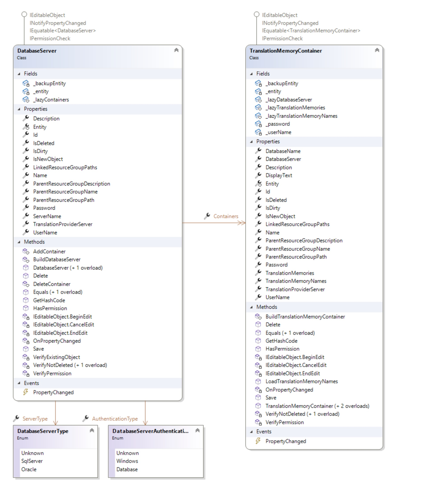

# Working with Database Servers and Containers

This article explains how to work with database servers and translation memory containers.

## Overview

Server-based translation memories reside in a database that is typically separate from the main TM server database. This database is called a translation memory container. TM Server can distribute server-based translation memories across multiple translation memory containers.

The API uses these two classes to model the concepts:

* **[DatabaseServer](../../api/translationmemory/Sdl.LanguagePlatform.TranslationMemoryApi.DatabaseServer.yml)**: A database server that hosts one or more translation memory containers. Register the database server before you use it to host containers. See [Register a database server](#register-a-database-server).
* **[TranslationMemoryContainer](../../api/translationmemory/Sdl.LanguagePlatform.TranslationMemoryApi.TranslationMemoryContainer.yml)**: A translation memory container is a database that runs on a registered database server. Each container can host one or more server-based translation memories ([ServerBasedTranslationMemory](../../api/translationmemory/Sdl.LanguagePlatform.TranslationMemoryApi.ServerBasedTranslationMemory.yml)). See [Create a translation memory container](#create-a-translation-memory-container).

## Register a database server

To register a database server with TM Server, create a new [DatabaseServer](../../api/translationmemory/Sdl.LanguagePlatform.TranslationMemoryApi.DatabaseServer.yml) object. Set its [Name](../../api/translationmemory/Sdl.LanguagePlatform.TranslationMemoryApi.DatabaseServer.yml#Sdl_LanguagePlatform_TranslationMemoryApi_DatabaseServer_Name) property for the display name and its [ServerName](../../api/translationmemory/Sdl.LanguagePlatform.TranslationMemoryApi.DatabaseServer.yml#Sdl_LanguagePlatform_TranslationMemoryApi_DatabaseServer_ServerName) property for the database server IP address or DNS name. Select the authentication type by setting [AuthenticationType](../../api/translationmemory/Sdl.LanguagePlatform.TranslationMemoryApi.DatabaseServer.yml#Sdl_LanguagePlatform_TranslationMemoryApi_DatabaseServer_AuthenticationType).

Use Windows authentication to access the database server with the Windows account that runs the application server. Use database authentication to provide the [UserName](../../api/translationmemory/Sdl.LanguagePlatform.TranslationMemoryApi.DatabaseServer.yml#Sdl_LanguagePlatform_TranslationMemoryApi_DatabaseServer_UserName) and [Password](../../api/translationmemory/Sdl.LanguagePlatform.TranslationMemoryApi.DatabaseServer.yml#Sdl_LanguagePlatform_TranslationMemoryApi_DatabaseServer_Password) for the database account. Call [Save](../../api/translationmemory/Sdl.LanguagePlatform.TranslationMemoryApi.DatabaseServer.yml#Sdl_LanguagePlatform_TranslationMemoryApi_DatabaseServer_Save) to register the database server.

## Create a translation memory container

To create a translation memory container, create a new [TranslationMemoryContainer](../../api/translationmemory/Sdl.LanguagePlatform.TranslationMemoryApi.TranslationMemoryContainer.yml) object. Set the [DatabaseServer](../../api/translationmemory/Sdl.LanguagePlatform.TranslationMemoryApi.DatabaseServer.yml) that will host the container, set the container [Name](../../api/translationmemory/Sdl.LanguagePlatform.TranslationMemoryApi.TranslationMemoryContainer.yml#Sdl_LanguagePlatform_TranslationMemoryApi_TranslationMemoryContainer_Name), and set the [DatabaseName](../../api/translationmemory/Sdl.LanguagePlatform.TranslationMemoryApi.TranslationMemoryContainer.yml#Sdl_LanguagePlatform_TranslationMemoryApi_TranslationMemoryContainer_DatabaseName). Call [Save](../../api/translationmemory/Sdl.LanguagePlatform.TranslationMemoryApi.TranslationMemoryContainer.yml#Sdl_LanguagePlatform_TranslationMemoryApi_TranslationMemoryContainer_Save) to create the container.

The [DatabaseName](../../api/translationmemory/Sdl.LanguagePlatform.TranslationMemoryApi.TranslationMemoryContainer.yml#Sdl_LanguagePlatform_TranslationMemoryApi_TranslationMemoryContainer_DatabaseName) property can use one of these values:

* The name of a database to create. The application server creates the database, so make sure that the account that connects to the database server has permission to create databases.
* The name of an existing, empty database. The application server creates the required schema in the existing database.
* The name of an existing translation memory container. For migration scenarios, you can register an existing container database. The system inspects the database and registers the translation memories that it finds.
