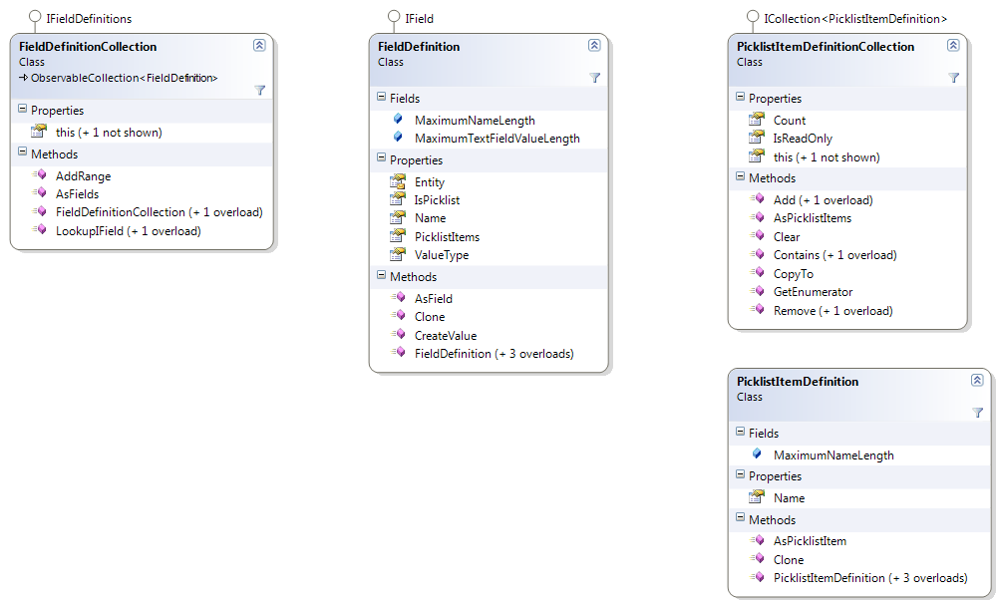

Working with Field Definitions
=====
This section describes how to work with field definitions within translation memories and fields templates.

Field Definitions
-----
A translation memory provides the capability to define custom translation units fields, which can be used to assocaiet additional information with translation units. Translation units can be filtered based expressions defined in terms of fields when performing various operations.

Every translation memory can have a collection of field definitions, represented by the FieldDefinitionCollection class, which is a collection of FieldDefinition objects.

Server-based translation memories have the ability to inherit their field definitions from a fields template (ServerBasedFieldsTemplate). When that is the case, the field definitions can be centrally managed via the fields template, but not on the translation memory itself. For more information, see Working with Field Templates.

A field definition can have one of the following types, as defined in **FieldValueType**:

* **SingleString**: A text field with a single text value.
* **MultipleString**: A text field with a multiple text values.
* **Integer**: An integer field with a single integer value.
* **DateTime**: A date/time field with a single date/time value.
* **SinglePicklist**: A field with a single value out of a set of possible string values.
* **MultiplePicklist**: A field with multiple values out of a set of possible string values.

Any changes made to the field definition collection are only actually persisted after saving the translation memory or fields template that owns the fields. This includes adding field definitions, deleting field definitions, renaming field definitions and adding/removing/renaming picklist items. When deleting a field definition, note that any values set for the field will be deleted from the translation memory.