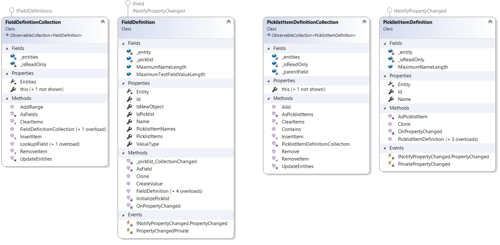

# Working with Field Definitions

This section explains how to work with field definitions in translation memories and field templates.

## Field definitions

A translation memory lets you define custom translation unit fields. Use these fields to store additional information with translation units and to filter translation units during different operations.

Each translation memory can include a collection of field definitions, represented by the [FieldDefinitionCollection](../../api/translationmemory/Sdl.LanguagePlatform.TranslationMemoryApi.FieldDefinitionCollection.yml) class. This collection contains [FieldDefinition](../../api/translationmemory/Sdl.LanguagePlatform.TranslationMemoryApi.FieldDefinition.yml) objects.

A field definition can use one of the following types, as defined in [FieldValueType](../../api/translationmemory/Sdl.LanguagePlatform.TranslationMemory.FieldValueType.yml):

* **SingleString**: A text field with one text value.
* **MultipleString**: A text field with multiple text values.
* **Integer**: An integer field with one integer value.
* **DateTime**: A date/time field with one date/time value.
* **SinglePicklist**: A field with one value from a set of possible string values.
* **MultiplePicklist**: A field with multiple values from a set of possible string values.

Changes to the field definition collection take effect only after you save the translation memory or field template that contains the fields. This includes adding, deleting, or renaming field definitions, and adding, removing, or renaming picklist items. When you delete a field definition, all values stored for that field are also removed from the translation memory.

## See also

* [Adding TM Fields](adding_tm_fields.md)
* [Working with File-based Translation Memories](working_with_file_based_translation_memories.md)
