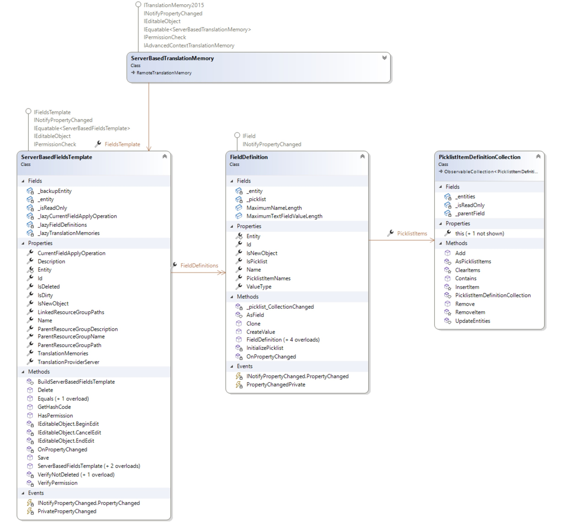

# Working with Field Templates

This topic explains how to use field templates to centralize server-based translation memory field definitions.

## Overview

Server-based translation memories support custom field definitions. These definitions let you attach metadata to translation units and use that metadata for filtering. For more information, see [Working with Field Definitions](working_with_field_definitions.md).

Managing field definitions for many translation memories can become tedious. Instead of defining field definitions for each translation memory individually, use a field template. A field template is a named collection of field definitions that server-based translation memories can inherit. When you update the template, the change propagates to every linked translation memory.

The [ServerBasedFieldsTemplate](../../api/translationmemory/Sdl.LanguagePlatform.TranslationMemoryApi.ServerBasedFieldsTemplate.yml) class represents a field template. To create one, instantiate a new [ServerBasedFieldsTemplate](../../api/translationmemory/Sdl.LanguagePlatform.TranslationMemoryApi.ServerBasedFieldsTemplate.yml) object, set its [Name](../../api/translationmemory/Sdl.LanguagePlatform.TranslationMemoryApi.ServerBasedFieldsTemplate.yml#Sdl_LanguagePlatform_TranslationMemoryApi_ServerBasedFieldsTemplate_Name) property, add field definitions to the [FieldDefinitions](../../api/translationmemory/Sdl.LanguagePlatform.TranslationMemoryApi.ServerBasedFieldsTemplate.yml#Sdl_LanguagePlatform_TranslationMemoryApi_ServerBasedFieldsTemplate_FieldDefinitions) collection, and then call [Save](../../api/translationmemory/Sdl.LanguagePlatform.TranslationMemoryApi.ServerBasedFieldsTemplate.yml#Sdl_LanguagePlatform_TranslationMemoryApi_ServerBasedFieldsTemplate_Save).

To associate a server-based translation memory with a field template, set the [FieldsTemplate](../../api/translationmemory/Sdl.LanguagePlatform.TranslationMemoryApi.ServerBasedTranslationMemory.yml#Sdl_LanguagePlatform_TranslationMemoryApi_ServerBasedTranslationMemory_FieldsTemplate) property and then call [Save](../../api/translationmemory/Sdl.LanguagePlatform.TranslationMemoryApi.ServerBasedTranslationMemory.yml#Sdl_LanguagePlatform_TranslationMemoryApi_ServerBasedTranslationMemory_Save) to persist the change. You can set the field template on a new translation memory or on an existing one.

