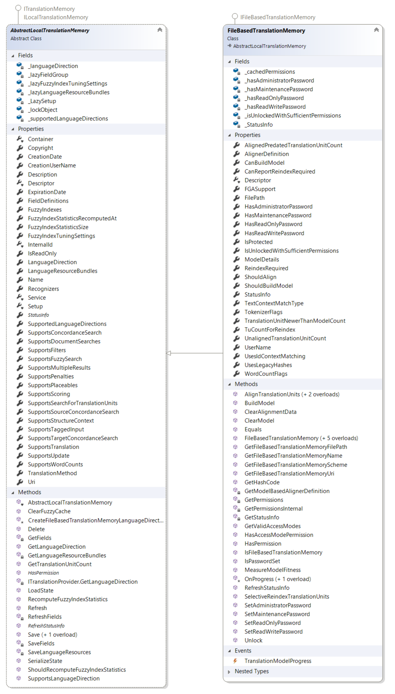

# Working with File-based Translation Memories

This section explains how to work with file-based translation memories.

## File-based translation memories

A file-based translation memory is an [ITranslationMemory](../../api/translationmemory/Sdl.LanguagePlatform.TranslationMemoryApi.ITranslationMemory.yml) stored in a file with the `.sdltm` extension. It is designed for single-user access and supports one language direction. You define the language direction when you create the translation memory, and you cannot change it later.

File-based translation memories use the [FileBasedTranslationMemory](../../api/translationmemory/Sdl.LanguagePlatform.TranslationMemoryApi.FileBasedTranslationMemory.yml) class. This class inherits from [AbstractLocalTranslationMemory](../../api/translationmemory/Sdl.LanguagePlatform.TranslationMemoryApi.AbstractLocalTranslationMemory.yml), the base class for file-based and in-memory translation memories such as [InMemoryTranslationMemory](../../api/translationmemory/Sdl.LanguagePlatform.TranslationMemoryApi.InMemoryTranslationMemory.yml).

## Password protection

File-based translation memories support password protection for specific access levels. The translation memory stores each password securely. To set a password for a lower access level, you must first set the passwords for all higher access levels. If you protect a translation memory with passwords, you must define passwords for all available access levels, and anyone who opens the translation memory must provide a password, including the administrator.

The following access levels can be protected by a password:

* **Administrator password**: Grants complete access to the translation memory and its contents.
* **Maintenance password**: Lets a maintenance user open the translation memory, view, edit, and delete translation units, and use the batch edit and delete tools. It does not allow imports or exports.
* **Translator password**: Lets a translator open the translation memory in the Editor view, edit and delete individual translation units, and add new translation units.
* **Guest password**: Lets a guest open the translation memory and work with its contents. Guests cannot edit or delete translation units, but they can add new units.

To access a password-protected translation memory, call the `Unlock` method and pass the password for the required access level.

## See also

* [Creating a File-based Translation Memory](creating_a_file_based_translation_memory.md)
* [Working with Field Definitions](working_with_field_definitions.md)
* [Working with Language Resources](working_with_language_resources.md)
* [Importing Content into a Translation Memory](importing_content_into_a_translation_memory.md)
* [Exporting Content from a Translation Memory](exporting_content_from_a_translation_memory.md)
* [Performing Translation Memory Lookups](performing_filebased_tm_lookups.md)
