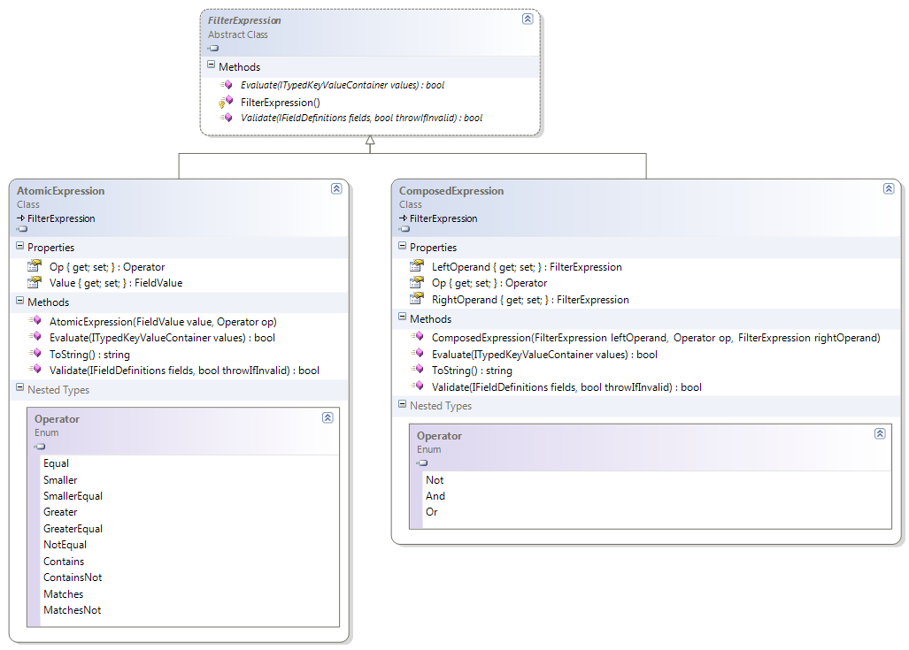

# Working with Filters

This section explains how to create translation unit filters for operations such as import, export, and search.

## Overview

Translation unit filters are represented by the abstract [FilterExpression](../../api/translationmemory/Sdl.LanguagePlatform.TranslationMemory.FilterExpression.yml) class. This class represents a Boolean expression that works on translation unit fields. Two concrete classes derive from it:

* **AtomicExpression**: A filter expression that compares a single translation unit field against a specified value by using a specified operator.
* **ComposedExpression**: A filter expression that builds complex filter expressions from other filter expressions, either by combining two filter expressions by using the AND or NOT operator, or by negating a filter expression. Composed filter expressions can be nested.

The field values ([FieldValue](../../api/translationmemory/Sdl.LanguagePlatform.TranslationMemory.FieldValue.yml)) that you can use in an atomic filter expression include:

* **User-defined fields**: See [Working with Field Definitions](working_with_field_definitions.md).
* **System fields**: These are built-in translation unit fields, as defined in [SystemFieldDefinitions](../../api/translationmemory/Sdl.LanguagePlatform.TranslationMemoryApi.SystemFieldDefinitions.yml).

## See also

* [Exporting to a TMX File](exporting_to_a_tmx_file.md)

* [Doing Translation Memory Lookups](doing_translation_memory_lookups.md)
