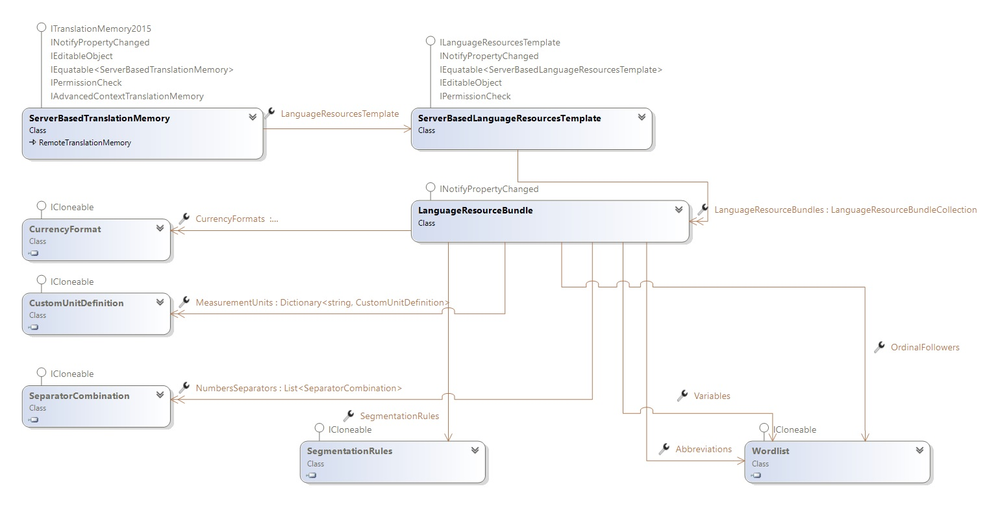

# Working with Language Resource Templates

This topic explains how to use language resource templates to centralize server-based translation memory language resources.

## Overview

Server-based translation memories support custom language resources. For more information, see [Working with Language Resources](working_with_language_resources.md).

Managing language resources across many translation memories can become tedious. Instead of defining language resources for each translation memory individually, use a language resource template. A language resource template is a named collection of language resources that server-based translation memories can inherit. When you update the template, the change propagates to every linked translation memory.

The [ServerBasedLanguageResourcesTemplate](../../api/translationmemory/Sdl.LanguagePlatform.TranslationMemoryApi.ServerBasedLanguageResourcesTemplate.yml) class represents a language resource template. To create one, instantiate a new [ServerBasedLanguageResourcesTemplate](../../api/translationmemory/Sdl.LanguagePlatform.TranslationMemoryApi.ServerBasedLanguageResourcesTemplate.yml) object, set its [Name](../../api/translationmemory/Sdl.LanguagePlatform.TranslationMemoryApi.ServerBasedLanguageResourcesTemplate.yml#Sdl_LanguagePlatform_TranslationMemoryApi_ServerBasedLanguageResourcesTemplate_Name) property, add language resource bundles to the [LanguageResourceBundles](../../api/translationmemory/Sdl.LanguagePlatform.TranslationMemoryApi.ServerBasedLanguageResourcesTemplate.yml#Sdl_LanguagePlatform_TranslationMemoryApi_ServerBasedLanguageResourcesTemplate_LanguageResourceBundles) collection, and then call [Save](../../api/translationmemory/Sdl.LanguagePlatform.TranslationMemoryApi.ServerBasedLanguageResourcesTemplate.yml#Sdl_LanguagePlatform_TranslationMemoryApi_ServerBasedLanguageResourcesTemplate_Save).

To associate a server-based translation memory with a language resource template, set the [LanguageResourcesTemplate](../../api/translationmemory/Sdl.LanguagePlatform.TranslationMemoryApi.ServerBasedTranslationMemory.yml#Sdl_LanguagePlatform_TranslationMemoryApi_ServerBasedTranslationMemory_LanguageResourcesTemplate) property and then call [Save](../../api/translationmemory/Sdl.LanguagePlatform.TranslationMemoryApi.ServerBasedTranslationMemory.yml#Sdl_LanguagePlatform_TranslationMemoryApi_ServerBasedTranslationMemory_Save) to persist the change. You can set the language resource template on a new translation memory or on an existing one.

