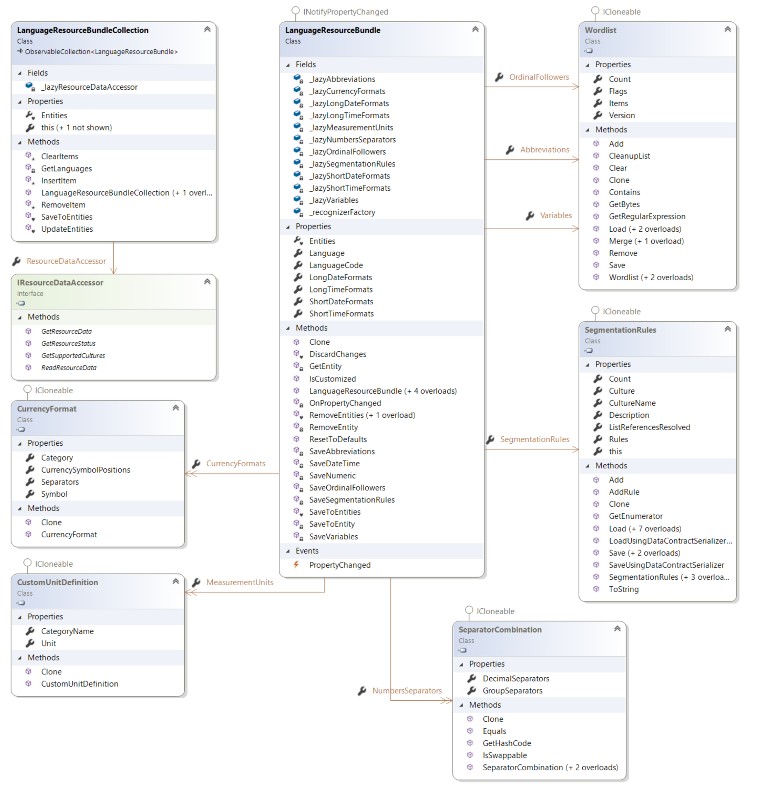

# Working with Language Resources

This section describes how to work with language resources within translation memories and field templates.

## Language resources

Translation memories support custom language resources such as segmentation rules, abbreviations, ordinal followers, variables, dates, times, numbers, measurements, and currency recognizers. Storing these resources in the translation memory ensures that they are used consistently during translation and when segmenting content that targets the translation memory. This helps maintain consistency and improve translation reuse.

The language resources within a translation memory or language resources template are represented by a [LanguageResourceBundleCollection](../../api/translationmemory/Sdl.LanguagePlatform.TranslationMemoryApi.LanguageResourceBundleCollection.yml). This is a collection of [LanguageResourceBundle](../../api/translationmemory/Sdl.LanguagePlatform.TranslationMemoryApi.LanguageResourceBundle.yml) objects, each of which represents language resources for a specific language. A translation memory can store language resources for its source language or languages.

There are nine types of customizable language resources:

1. **Abbreviations**: The segmentation engine uses a default source-language abbreviation list when it segments text. The list contains common abbreviations in the source language, such as max., min., and usd. If the segmentation engine finds a full stop after text that appears in the abbreviation list, it treats the full stop as part of the abbreviation and continues reading until the next full stop. You can manage the abbreviations list through a Wordlist object.

2. **Ordinal followers**: The segmentation engine uses a default source-language ordinal follower list when it segments text. An ordinal follower, or ordinal noun, is a word that typically follows a number. The list allows the segmentation engine to read past a full stop that comes after a number and before an ordinal noun. This behavior is not relevant for all languages, but it is especially useful for German. A dot is not interpreted as a segment boundary if it follows a number and precedes an ordinal noun. You can manage the ordinal followers list through a Wordlist object.

3. **Segmentation rules**: Segmentation rules control how text breaks into segments. Segments can be paragraph- or sentence-length. As a general rule, in English, a full stop, exclamation mark, question mark, colon, tab character, or end-of-paragraph mark indicates the end of a sentence when followed by a space. A quotation mark (`"` or `'`) or a closing parenthesis (`)`) may follow the closing punctuation mark and precede the space. A semicolon (`;`) does not end a sentence. You can customize the segmentation rules through the SegmentationRules object.

4. **Variables**: This is a custom list of variables in the translation memory setup. Each item in the list is treated as a non-translatable, placeable element. For example, you may not want to translate a company name. Adding it to the variable list marks it as untranslatable content. The variable list has these requirements:
   * Variables must appear exactly as they do in your documents.
   * Each item in the list must be on a line of its own.
   * Punctuation inside variables, such as hyphens or commas, is not supported.
   * As well as the variables themselves, the list can include comments or headings. Comments or headings must be directly preceded by the hash symbol (#), for example, #comment.
   
	   You can manage variables through a Wordlist object, just like abbreviations and ordinal followers.

5. **Date recognizers**: See below.

6. **Time recognizers**: Date and time formats can differ from one language to another, so the date and time recognizers let you customize these formats for the current source and target languages. Both are represented as lists of strings.

7. **Numbers recognizers**: By default, each source and target language has a list of number formats. This helps the system recognize source-language numbers and localize them correctly in the target language. Numbers recognizers are represented as lists of SeparatorCombination objects.

8. **Measurements recognizers**: In addition to the default measurements for source and target languages, you can add new or customized measurements. The system identifies them as placeables during translation. Measurements recognizers are represented as dictionaries of string keys and CustomUnitDefinition values.

9. **Currency recognizers**: Similar to the other recognizer types, Var:ProductName uses a default list of currency formats, including symbols and symbol placement, for each source and target language. Expanding this list helps the system recognize source-language currency formats and localize them correctly in the target language. You can manage currency recognizers through a list of CurrencyFormat objects.

To define custom language resources for a language, create a [LanguageResourceBundle](../../api/translationmemory/Sdl.LanguagePlatform.TranslationMemoryApi.LanguageResourceBundle.yml) object for that language. Then create the required resource objects, such as a Wordlist populated with a custom list of variables, and assign them to the appropriate properties, such as [Abbreviations](../../api/translationmemory/Sdl.LanguagePlatform.TranslationMemoryApi.LanguageResourceBundle.yml#Sdl_LanguagePlatform_TranslationMemoryApi_LanguageResourceBundle_Abbreviations). Add the bundle to the language resource bundle collection, then save the translation memory or language resources template that owns the collection.

In most cases, you modify the default language resources rather than create them from scratch. You can retrieve the default language resources from the [DefaultLanguageResourceProvider](../../api/translationmemory/Sdl.LanguagePlatform.TranslationMemoryApi.DefaultLanguageResourceProvider.yml), or by calling [GetDefaultLanguageResources](../../api/translationmemory/Sdl.LanguagePlatform.TranslationMemoryApi.DefaultLanguageResourceProvider.yml#Sdl_LanguagePlatform_TranslationMemoryApi_DefaultLanguageResourceProvider_GetDefaultLanguageResources_Sdl_Core_Globalization_CultureCode_) in a server scenario. This approach is mainly required when you access the default language resources from Silverlight, because the [DefaultLanguageResourceProvider](../../api/translationmemory/Sdl.LanguagePlatform.TranslationMemoryApi.DefaultLanguageResourceProvider.yml) is not available there. Both methods return the same defaults, but using the [DefaultLanguageResourceProvider](../../api/translationmemory/Sdl.LanguagePlatform.TranslationMemoryApi.DefaultLanguageResourceProvider.yml) is more efficient because it does not require a server round trip.

## See also

* [Adding Language Resources](adding_language_resources.md)
* [Working with Language Resource Templates](working_with_language_resource_templates.md)
