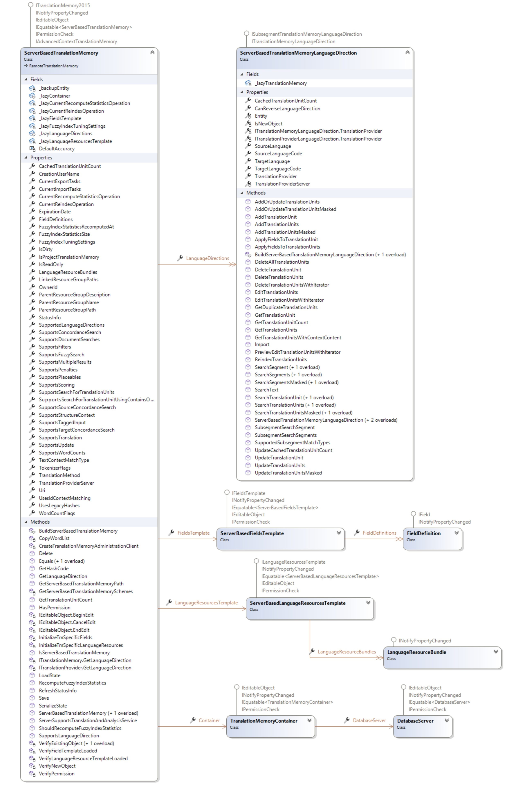

# Working with Server-based Translation Memories

This topic explains how to create and manage server-based translation memories.

## Overview

A server-based translation memory is a translation memory ([ITranslationMemory](../../api/translationmemory/Sdl.LanguagePlatform.TranslationMemoryApi.ITranslationMemory.yml)) that runs on TM Server. It supports multiple users and multiple language directions. A server-based translation memory is stored in a translation memory container ([TranslationMemoryContainer](../../api/translationmemory/Sdl.LanguagePlatform.TranslationMemoryApi.TranslationMemoryContainer.yml)), which uses a Microsoft SQL Server database.

The [ServerBasedTranslationMemory](../../api/translationmemory/Sdl.LanguagePlatform.TranslationMemoryApi.ServerBasedTranslationMemory.yml) class represents a server-based translation memory. To create one, instantiate a new [ServerBasedTranslationMemory](../../api/translationmemory/Sdl.LanguagePlatform.TranslationMemoryApi.ServerBasedTranslationMemory.yml) object and pass the [TranslationProviderServer](../../api/translationmemory/Sdl.LanguagePlatform.TranslationMemoryApi.TranslationProviderServer.yml) on which the translation memory should be created to the constructor. Then set the required properties, such as [Name](../../api/translationmemory/Sdl.LanguagePlatform.TranslationMemoryApi.RemoteTranslationMemory.yml#Sdl_LanguagePlatform_TranslationMemoryApi_RemoteTranslationMemory_Name) and [Container](../../api/translationmemory/Sdl.LanguagePlatform.TranslationMemoryApi.ServerBasedTranslationMemory.yml#Sdl_LanguagePlatform_TranslationMemoryApi_ServerBasedTranslationMemory_Container), and add language directions to the [LanguageDirections](../../api/translationmemory/Sdl.LanguagePlatform.TranslationMemoryApi.ServerBasedTranslationMemory.yml#Sdl_LanguagePlatform_TranslationMemoryApi_ServerBasedTranslationMemory_LanguageDirections) collection. Optionally, add custom field definitions and language resources, and then call [Save](../../api/translationmemory/Sdl.LanguagePlatform.TranslationMemoryApi.ServerBasedTranslationMemory.yml#Sdl_LanguagePlatform_TranslationMemoryApi_ServerBasedTranslationMemory_Save) to create the translation memory on the server.

Server-based translation memories also support the following capabilities:

* **Field templates**: Instead of defining field definitions for each translation memory individually, server-based translation memories can inherit their field definitions from a field template. For more information, see [Working with Field Templates](working_with_field_templates.md).
* **Language resource templates**: Instead of defining language resources for each translation memory individually, server-based translation memories can inherit their language resources from a language resource template. For more information, see [Working with Language Resource Templates](working_with_language_resource_templates.md).
* **Scheduled import and export**: Instead of importing remotely over the network or internet, you can schedule an import or export on the server. For more information, see [Performing a Scheduled Import or Export](performing_a_scheduled_import_or_export.md).

