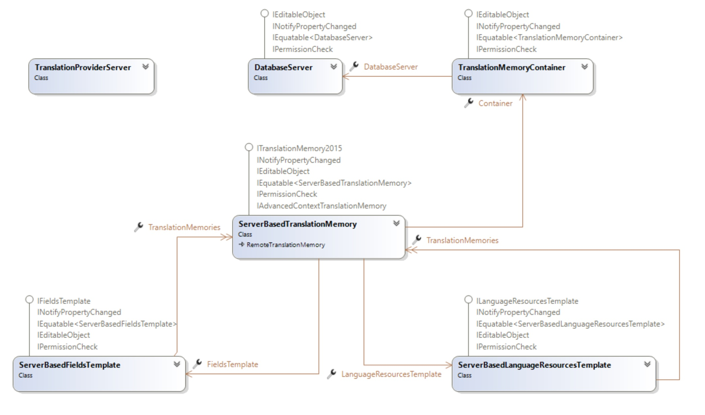

Introduction
===
This section and the subsequent section describe working with TM Server and server-based translation memories.

TM Server
----
TM Server is a server-based system that allows hosting translation memories on a central server and provides remote access and management functionality.

See Also
--------
[Connecting to TM Server](connecting_to_tm_server.md)

[Working with Database Servers and Containers](working_with_database_servers_and_containers.md)

[Working with Server-based Translation Memories](working_with_server_based_translation_memories.md)

[Working with Field Templates](working_with_field_templates.md)

[Working with Language Resource Templates](working_with_language_resource_templates.md)

[Performing a Scheduled Import or Export](performing_a_scheduled_import_or_export.md)

[Introduction](working_with_translation_memories.md)