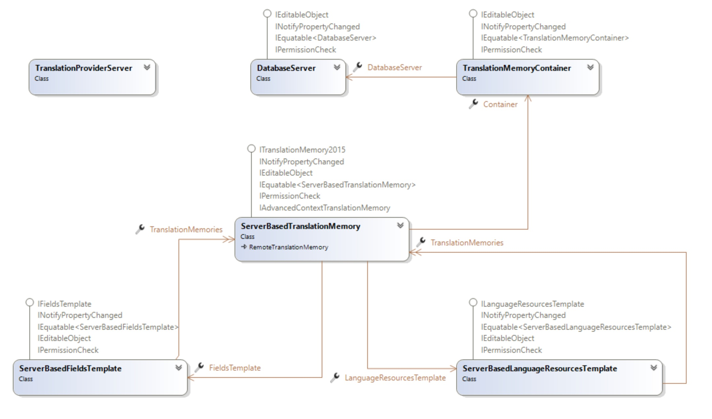

>[!NOTE]
>For all server-based resource interactions, we strongly recommend using the GroupShare API Toolkit, which is designed specifically for secure and efficient integration with GroupShare services. You can find resources [here](https://developers.rws.com/groupshare-api-docs/apiconcepts/overview.html). 
>
>We value feedback from our developer community. Share your thoughts, implementation experiences, and questions regarding these changes on the [Trados Studio Developers Forum](https://community.rws.com/developers-more/trados-portfolio/trados-studio-developers/f/sdk_qa). Your input will help refine the APIs and ensure a smoother transition to the new architecture.

# Introduction

This section introduces TM Server and server-based translation memories.

## TM Server

TM Server hosts translation memories on a central server and provides remote access and management functionality.

## See Also
[Connecting to TM Server](connecting_to_tm_server.md)

[Working with Database Servers and Containers](working_with_database_servers_and_containers.md)

[Working with Server-based Translation Memories](working_with_server_based_translation_memories.md)

[Working with Field Templates](working_with_field_templates.md)

[Working with Language Resource Templates](working_with_language_resource_templates.md)

[Performing a Scheduled Import or Export](performing_a_scheduled_import_or_export.md)

[Introduction](working_with_translation_memories.md)
