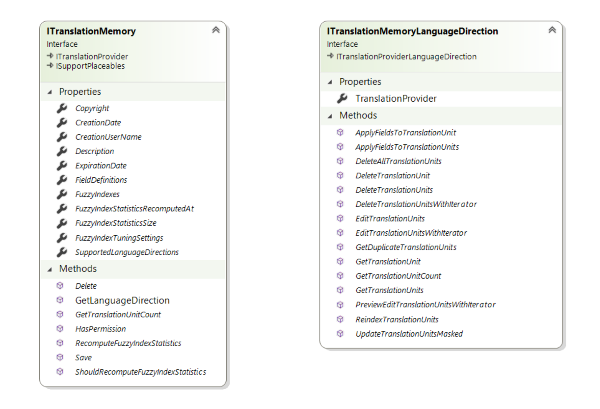
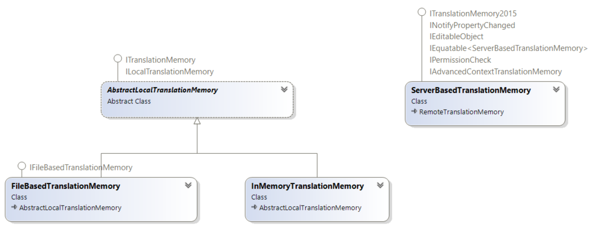

# Introduction

This section explains how to work with local translation memories.

## Overview

The Translation Memory API represents a translation memory with the [ITranslationMemory](../../api/translationmemory/Sdl.LanguagePlatform.TranslationMemoryApi.ITranslationMemory.yml) interface. A translation memory is a type of translation provider (see [ITranslationProvider](../../api/translationmemory/Sdl.LanguagePlatform.TranslationMemoryApi.ITranslationProvider.yml)) that exposes translation memory-specific functionality. For more information about translation providers, see [Creating the Translation Provider](creating_the_translation_provider.md).

[ITranslationMemory](../../api/translationmemory/Sdl.LanguagePlatform.TranslationMemoryApi.ITranslationMemory.yml) represents a multilingual translation memory, which can contain one or more language directions. Each language direction is represented by an [ITranslationMemoryLanguageDirection](../../api/translationmemory/Sdl.LanguagePlatform.TranslationMemoryApi.ITranslationMemoryLanguageDirection.yml) object.

The [ITranslationMemory](../../api/translationmemory/Sdl.LanguagePlatform.TranslationMemoryApi.ITranslationMemory.yml) interface has three implementations:

* **File-based translation memory**: Stores a translation memory in a single file on disk for single-user access. File-based translation memories support one language direction. For more information, see [Working with File-based Translation Memories](working_with_file_based_translation_memories.md).
* **Server-based translation memory**: Hosts a translation memory on a server and exposes it through a REST API. The translation memory data is stored in a central Microsoft SQL Server database. For more information, see [Introduction](working_with_tm_server.md).
* **In-memory translation memory**: Keeps translation memory data in memory only. Use this implementation when you need a small, fast translation memory that does not need to persist data.

In addition to the functionality available in any translation provider, a translation memory provides these features:

* **Field definitions**: Define fields that associate custom metadata with translation units. Use this metadata to filter translation units during different operations. For more information, see [Working with Field Definitions](working_with_field_definitions.md).
* **Language resources**: Store custom language resources such as segmentation rules, abbreviations, ordinal followers, variables, dates, times, numbers, measurements, and currency recognizers. These resources help keep translation and segmentation behavior consistent for the target translation memory. For more information, see [Working with Language Resources](working_with_language_resources.md).
* **Import**: Import translation units from TMX or other supported bilingual file formats. For more information, see [Importing Content into a Translation Memory](importing_content_into_a_translation_memory.md).
* **Export**: Export translation units to a TMX file. For more information, see [Exporting Content from a Translation Memory](exporting_content_from_a_translation_memory.md).

The [ITranslationMemory](../../api/translationmemory/Sdl.LanguagePlatform.TranslationMemoryApi.ITranslationMemory.yml) interface also provides management functionality for properties such as name, description, language directions, fields, and language resources. Call [Save](../../api/translationmemory/Sdl.LanguagePlatform.TranslationMemoryApi.ITranslationMemory.yml#Sdl_LanguagePlatform_TranslationMemoryApi_ITranslationMemory_Save) after you change any of these properties.

## See also

* [Working with File-based Translation Memories](working_with_file_based_translation_memories.md)
* [Working with Field Definitions](working_with_field_definitions.md)
* [Working with Language Resources](working_with_language_resources.md)
* [Importing Content into a Translation Memory](importing_content_into_a_translation_memory.md)
* [Exporting Content from a Translation Memory](exporting_content_from_a_translation_memory.md)
* [Performing Translation Memory Lookups](performing_filebased_tm_lookups.md)
