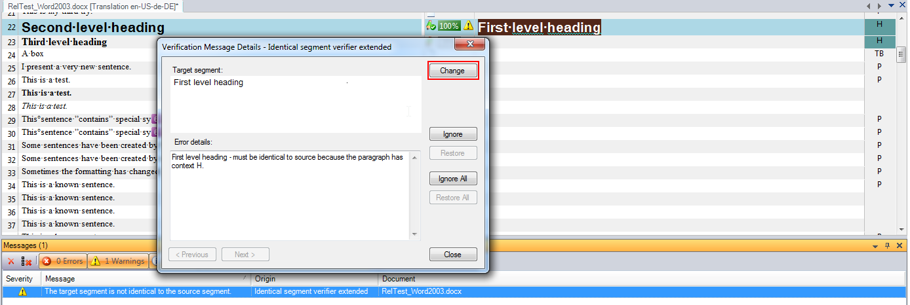
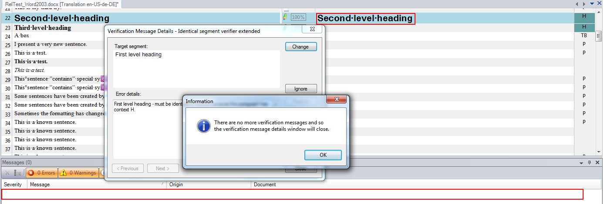

## Add Suggestion to a Custom Message Control
A suggestion can be added to the `IdenticalCheck` custom message control, as described in [Create a Custom MessageControl](create_a_custom_message_control.md).

A suggestion is a proposed change to the document that resolves the verification issue described by the message.

The project is available in the samples directory: [Sdl.Verification.Sdk.IdenticalCheck.Extended](https://github.com/RWS/trados-studio-api-samples/tree/master/Verification/Sdl.Verification.Sdk.IdenticalCheck.Extended).

## Overview
The `IdenticalCheck` custom message control can be adapted to suggest replacing the target segment's content with the source segment. When a suggestion is available, the Change button becomes enabled.




Clicking the Change button applies the suggestion, making the target segment identical to the source segment. This resolves the verification issue and removes the message.



## Changing the Custom User Control to Be a Suggestion Provider
The custom user control provides suggestions and may allow users to select one. To enable this, it should implement [ISuggestionProvider](../../api/verification/Sdl.Verification.Api.ISuggestionProvider.yml).

The `IdenticalVerifierMessageUI` custom user control must implement [ISuggestionProvider](../../api/verification/Sdl.Verification.Api.ISuggestionProvider.yml) to suggest replacing the target segment's content with the source segment.

1. Add a reference to `Sdl.Verification.Api`.
2. Implement [ISuggestionProvider](../../api/verification/Sdl.Verification.Api.ISuggestionProvider.yml) in the class. Use Visual Studio to generate empty implementations.
3. Ensure `HasSuggestion` always returns `true`, as the suggestion is always to replace the target segment's content with the source segment.

# [C#](#tab/tabid-1)
```cs
public Suggestion GetSuggestion()
{
    return _suggestion;
}

public bool HasSuggestion()
{
    return true;
}

public event EventHandler SuggestionChanged;
```
***

The `IdenticalVerifierMessageUI` custom user control requires the source segment to suggest replacing the target segment's content.

1. Add a reference to `Sdl.FileTypeSupport.Framework.BilingualApi`.
2. Use the `ReplaceDocumentSegment` property of the `IdenticalVerifierMessageData` class to create a new suggestion.

# [C#](#tab/tabid-2)
```cs
public IdenticalVerifierMessageUI(MessageEventArgs messageEventArgs, ISegment originalSegment)
{
    InitializeComponent();

    #region Get ExtendedMessage Data
    IdenticalVerifierMessageData messageData = (IdenticalVerifierMessageData)messageEventArgs.ExtendedData;
    this.tb_ErrorDetails.Text = messageData.ErrorDetails;
    _suggestion = new Suggestion(messageEventArgs.FromLocation, messageEventArgs.UptoLocation, 
        messageData.ReplacementSuggestion.Clone() as IAbstractMarkupData);
    #endregion

    _originalSegment.Dock = DockStyle.Fill;
    _originalSegment.IsReadOnly = true;
    _originalSegment.ReplaceDocumentSegment(originalSegment.Clone() as ISegment);
    panel_Original.Controls.Add(_originalSegment);
}
```
***

A suggestion is always a replacement where the target contents from one location upto another location is replaced by the new markup. If the new markup is null then the suggestion effectively deletes the contents from one location upto another location. Always set the new markup to null to delete content and do not use empty text markup.

The `IdenticalVerifierMessageUI` constructor now has the from and upto locations from the verification message (messageEventArgs) and the new markup from the source segment (messageData.ReplacementSuggestion). All that remains is for `IdenticalVerifierMessageUI` constructor to create the Suggestion and store it in a member variable for the GetSuggestion method.

1. Add a private member variable called _suggestion of type [Suggestion](../../api/verification/Sdl.Verification.Api.Suggestion.yml).
2. Create the _suggestion from the messageEventArgsFromLocation and UptoLocation and from the messageData.ReplacementSuggestion.
3. Change the GetSuggestion method to return this suggestion.

# [C#](#tab/tabid-3)
```cs
using System;
using System.Windows.Forms;

using Sdl.DesktopEditor.BasicControls;
using Sdl.FileTypeSupport.Framework.BilingualApi;
using Sdl.FileTypeSupport.Framework.IntegrationApi;
using Sdl.Verification.Api;

namespace Verification.Sdk.IdenticalCheck.Extended.MessageUI
{
    public partial class IdenticalVerifierMessageUI : UserControl, ISuggestionProvider
    {
        #region Create Edit Controls
        /// <summary>
        /// Source segment edit control
        /// </summary>
        private readonly BasicSegmentEditControl _originalSegment = new BasicSegmentEditControl();

        /// <summary>
        /// Target segment edit control
        /// </summary>
        private readonly BasicSegmentEditControl _suggestedSegment = new BasicSegmentEditControl();
        #endregion

        private Suggestion _suggestion;

        #region Constructor
        public IdenticalVerifierMessageUI(MessageEventArgs messageEventArgs, ISegment originalSegment)
        {
            InitializeComponent();

            #region Get ExtendedMessage Data
            IdenticalVerifierMessageData messageData = (IdenticalVerifierMessageData)messageEventArgs.ExtendedData;
            this.tb_ErrorDetails.Text = messageData.ErrorDetails;
            _suggestion = new Suggestion(messageEventArgs.FromLocation, messageEventArgs.UptoLocation, 
                messageData.ReplacementSuggestion.Clone() as IAbstractMarkupData);
            #endregion

            _originalSegment.Dock = DockStyle.Fill;
            _originalSegment.IsReadOnly = true;
            _originalSegment.ReplaceDocumentSegment(originalSegment.Clone() as ISegment);
            panel_Original.Controls.Add(_originalSegment);
        }
        #endregion

        #region ISuggestionProvider
        public Suggestion GetSuggestion()
        {
            return _suggestion;
        }

        public bool HasSuggestion()
        {
            return true;
        }

        public event EventHandler SuggestionChanged;
        #endregion
    }
}
```
***

## Summary
That completes the work necessary to allow the `IdenticalVerifierMessageUI`custom message control to provide a suggestion for verification messages produced by the IdenticalCheck global verifier. If the user views a verification message produced by the IdenticalCheck global verifier then the Change button will be enabled and clicking on the Change button will apply the suggestion where the contents of the target segment is replaced with the contents of the source segment as described in the [Overview](overview.md).

In this simple example, the `SuggestionChanged` event was not used. In complex custom message controls, there may be more than one reasonable suggestion that the user could choose from. These suggestions could be represented in a control like a combo-box or a list box where the user can select a suggestion. As the user selects a suggestion, selects a different suggestion, or "unselects" a suggestion the `SuggestionChanged` event should be fired. This event is listened to by the verification form that updates whether the Change button is enabled or not.
