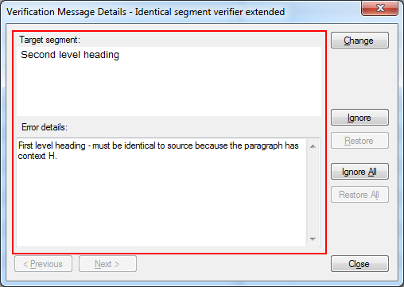

# Create a Custom Message Control
In this section, you will develop a simple custom message control for the IdenticalCheck global verifier described in [How to Create a Global Verifier](how_to_create_a_global_verifier.md).

This project can be found in the samples directory under [Sdl.Verification.Sdk.IdenticalCheck.Extended](https://github.com/RWS/trados-studio-api-samples/tree/master/Verification/Sdl.Verification.Sdk.IdenticalCheck.Extended/MessageUI)

## Overview
The custom message control you will develop displays a `BasicSegmentEditControl` with the target segment, a text box describing the identical verification message, and the paragraph context.



## Creating the custom message data class
During verification, the verifier creates verification messages that include the text, origin, severity (note, warning, error), and from and up-to locations.

In the IdenticalCheck global verifier, you need to add paragraph context to the verification message. To do this, add a custom message data object that contains detailed error information with paragraph context. You also want to provide a suggestion for target segment replacement.

A custom message data class needs to be defined for the custom message data object with the paragraph context and suggestion for target segment replacement.

1. Create a class called `IdenticalVerifierMessageData`.
2. Change the constructor so that it accepts a string `errorDetails` argument.
3. Add a `ErrorDetails` property with a public getter and a private setter.
4. Change the constructor so that it sets the `ErrorDetails` property from the `errorDetails` argument.
5. Add a `Suggestion` property with a public getter and a private setter.
6. Change the constructor so that it sets the `Suggestion` property from the `suggestion` argument.

A custom message class also needs to inherit from [Sdl.FileTypeSupport.Framework.IntegrationApi.ExtendedMessageEventData](../../api/filetypesupport/Sdl.FileTypeSupport.Framework.IntegrationApi.ExtendedMessageEventData.yml). `ExtendedMessageEventData` has a `MessageType` property that should be set to uniquely identify this type of verification message.
1. Add a using reference to `Sdl.FileTypeSupport.Framework.IntegrationApi`.
2. Make the class inherit from [ExtendedMessageEventData](../../api/filetypesupport/Sdl.FileTypeSupport.Framework.IntegrationApi.ExtendedMessageEventData.yml).
3. Change the constructor so that it sets the `MessageType` to "Sdl.Verification.Sdk.IdenticalCheck.Extended, Error_NotIdentical".
The complete message class should look as follows:

# [C#](#tab/tabid-1)
```cs
using Sdl.FileTypeSupport.Framework.BilingualApi;
using Sdl.FileTypeSupport.Framework.IntegrationApi;

namespace Verification.Sdk.IdenticalCheck.Extended.MessageUI
{
    public class IdenticalVerifierMessageData : ExtendedMessageEventData
    {
        public IdenticalVerifierMessageData(string errorDetails, ISegment replacementSuggestion)
        {
            this.ErrorDetails = errorDetails;
            this.ReplacementSuggestion = replacementSuggestion;

            //Identifier for this custom message type
            this.MessageType = "Sdl.Verification.Sdk.IdenticalCheck.MessageUI, Error_NotIdentical";
        }

        /// <summary>
        /// Information which will be displayed in our custom UI.
        /// </summary>
        public string ErrorDetails
        {
            get;
            private set;
        }

        /// <summary>
        /// Suggestion which will be used in the custom UI for target segment replacement.
        /// </summary>
        public ISegment ReplacementSuggestion
        {
            get; 
            private set;
        }
    }
}
```
***

## Adding the custom message data object to the verification message
Every verifier uses the message reporter to create verification messages. Any verifier that needs to add custom message data to the verification message needs to create their custom message data object and pass this to the message reporter.

In the `IdenticalCheck global verifier`, `IdenticalVerifierMain.CheckParagraphUnit` uses the message reporter to create verification messages. CheckParagraphUnit needs to be modified to create an `IdenticalVerifierMessageData` object with the paragraph context and the source segment as proposed suggestion.

In `IdenticalVerifierMain.CheckParagraphUnit`, add the following before the line that begins `MessageReporter.ReportMessage`:

# [C#](#tab/tabid-2)
```cs
string context = paragraphUnit.Properties.Contexts.Contexts[0].DisplayCode;
IdenticalVerifierMessageData extendedData = new IdenticalVerifierMessageData(completeTextTarget +
    " - must be identical to source because the paragraph has context " + context + ".", segmentPair.Source);
```
***

After creating the custom or extended data object, pass it to the message reporter. Only some message reporters can handle custom or extended data. These extended message reporters implement the [IBilingualContentMessageReporterWithExtendedData](../../api/filetypesupport/Sdl.FileTypeSupport.Framework.BilingualApi.IBilingualContentMessageReporterWithExtendedData.yml) interface and contain a `ReportMessage` method that includes extended data as an argument. Therefore, the message reporter must be cast to an extended message reporter before it can pass extended data.

In `IdenticalVerifierMain.CheckParagraphUnit`, replace the call to `MessageReporter.ReportMessage` with the following:

# [C#](#tab/tabid-3)
```cs
IBilingualContentMessageReporterWithExtendedData extendedMessageReporter = (IBilingualContentMessageReporterWithExtendedData)MessageReporter;
extendedMessageReporter.ReportMessage(this, PluginResources.Plugin_Name,
    ErrorLevel.Warning, PluginResources.Error_NotIdentical,
    new TextLocation(new Location(segmentPair.Target, true), 0),
    new TextLocation(new Location(segmentPair.Target, false), segmentPair.Target.ToString().Length - 1),
    extendedData);
```
***

Since only some message reporters can handle custom or extended data and implement [IBilingualContentMessageReporterWithExtendedData](../../api/filetypesupport/Sdl.FileTypeSupport.Framework.BilingualApi.IBilingualContentMessageReporterWithExtendedData.yml), add code to guard against this. In the following code, the message reporter is checked to see whether it implements [IBilingualContentMessageReporterWithExtendedData](../../api/filetypesupport/Sdl.FileTypeSupport.Framework.BilingualApi.IBilingualContentMessageReporterWithExtendedData.yml). If it does, extended data is passed to `ReportMessage`; otherwise, it is not.

# [C#](#tab/tabid-4)
```cs
if (MessageReporter is IBilingualContentMessageReporterWithExtendedData)
{
    #region CreateExtendedData
    string context = paragraphUnit.Properties.Contexts.Contexts[0].DisplayCode;
    IdenticalVerifierMessageData extendedData = new IdenticalVerifierMessageData(completeTextTarget +
        " - must be identical to source because the paragraph has context " + context + ".", segmentPair.Source);
    #endregion

    #region ReportingMessageWithExtendedData
    IBilingualContentMessageReporterWithExtendedData extendedMessageReporter = (IBilingualContentMessageReporterWithExtendedData)MessageReporter;
    extendedMessageReporter.ReportMessage(this, PluginResources.Plugin_Name,
        ErrorLevel.Warning, PluginResources.Error_NotIdentical,
        new TextLocation(new Location(segmentPair.Target, true), 0),
        new TextLocation(new Location(segmentPair.Target, false), segmentPair.Target.ToString().Length - 1),
        extendedData);
    #endregion

}
else
{
    #region ReportingMessageWithoutExtendedData
    MessageReporter.ReportMessage(this, PluginResources.Plugin_Name,
        ErrorLevel.Warning, PluginResources.Error_NotIdentical,
        new TextLocation(new Location(segmentPair.Target, true), 0),
        new TextLocation(new Location(segmentPair.Target, false), segmentPair.Target.ToString().Length - 1));
    #endregion
}
```
***


## Creating a custom message control
The custom message control is a user-control that is created by the custom message plug-in just before showing a verification message. A custom message control only shows one verification message and after showing the verification message then it is disposed. It does not have to implement any specific interfaces or constructors. The custom message plug-in is responsible for passing any information that the custom message control needs in the constructor.

Verification messages are represented by `MessageEventArgs` in [Sdl.FileTypeSupport.Framework.IntegrationApi.MessageEventArgs](../../api/filetypesupport/Sdl.FileTypeSupport.Framework.IntegrationApi.MessageEventArgs.yml), which contains information such as message text, message severity (note, warning, error), message origin, text location, and extended data. Most custom message controls require `MessageEventArgs` to be passed in the constructor from the custom message plug-in.

In the `IdenticalCheck` global verifier, a simple user-control needs to be created to display the identical verification message with the paragraph context and suggestion for target segment replacement.

1. Create a user-control called `IdenticalVerifierMessageUI`.
2. Add a panel and resize it in way you would like to represent the target segment content.
3. Add a text box for displaying detailed error message.
4. Add using reference to `Sdl.FileTypeSupport.Framework.IntegrationApi`.
5. Add an argument to the constructor called messageEventArgs with type `MessageEventArgs`
6. Add an argument to the constructor called `originalSegment` with type [ISegment](../../api/filetypesupport/Sdl.FileTypeSupport.Framework.BilingualApi.ISegment.yml)
7. The custom message control can be any size but it is important to set the `MinimumSize` on the control. If the custom message control's minimum size is too large for the verification form then the custom message control will be displayed with scroll bars. The verification form has a minimum size so ideally the custom message control should be developed to always display without clipping and without scroll bars. To do this, the custom message control should be developed to have a minimum size of 392, 275 or less.

The `messageEventArgs` contains all the information about the verification message including the custom or extended data in the ExtendedData property. The ExtendedData property will reference the identical verifier's custom data object - `IdenticalVerifierMessageData` - and this contains the` ErrorDetails` and `ReplacementSuggestion` properties we need in our custom UI.

Add the following code to the constructor to retrieve and set the data required in the custom UI control and the private Suggestion field which will be used to replace target segment content.

# [C#](#tab/tabid-5)
```cs
IdenticalVerifierMessageData messageData = (IdenticalVerifierMessageData)messageEventArgs.ExtendedData;
this.tb_ErrorDetails.Text = messageData.ErrorDetails;
_suggestion = new Suggestion(messageEventArgs.FromLocation, messageEventArgs.UptoLocation, 
    messageData.ReplacementSuggestion.Clone() as IAbstractMarkupData);
```
***

Now you need controls that can display the target segment. The [Sdl.DesktopEditor.BasicControls.BasicSegmentEditControl](../../api/integration/Sdl.DesktopEditor.BasicControls.BasicSegmentEditControl.yml) is a simplified control for basic display and editing of bilingual content. In the custom UI, initialize this control and add it to the panel created earlier. The `BasicSegmentEditControl` can be set as read-only. For read/write support, you would need to add events to handle manual translator edits.

## Creating a custom message plug-in
A custom message plug-in only supports some verification messages and not all verification messages. For those supported verification messages, a custom message plug-in can create a custom message control to show the supported verification message. A custom message plug-in needs to implement [IMessageControlPlugIn](../../api/verification/Sdl.Verification.Api.IMessageControlPlugIn.yml) and the the class should be marked with the [MessageControlPlugInAttribute](../../api/verification/Sdl.Verification.Api.MessageControlPlugInAttribute.yml).

In the `IdenticalCheck` global verifier, a custom message plug-in needs to be developed to create custom message controls; `IdenticalVerifierMessageUI`.

1. Create a class called `IdenticalVerifierMessagePlugIn`.
2. Add using reference to `Sdl.DesktopEditor.EditorApi`.
3. Add using reference to `Sdl.FileTypeSupport.Framework.BilingualApi`.
4. Add using reference to `Sdl.FileTypeSupport.Framework.IntegrationApi`.
5. Add using reference to `Sdl.Verification.Api`.
6. Mark the class with the `MessageControlPlugIn` attribute.
7. Make the class implement [IMessageControlPlugIn](../../api/verification/Sdl.Verification.Api.IMessageControlPlugIn.yml) - use Visual Studio to add empty implementations.
`IdenticalVerifierMessagePlugIn` needs to implement the `SupportsMessage` method and determine whether a given verification message is supported or not. All the verification messages reported by the `IdenticalCheck` global verifier include a custom or extended data object with type `IdenticalVerifierMessageData`.

Replace `IdenticalVerifierMessagePlugIn.SupportsMessage` method with the following code.

# [C#](#tab/tabid-6)
```cs
public bool SupportsMessage(MessageEventArgs messageEventArgs)
{
    return messageEventArgs.ExtendedData != null &&
           messageEventArgs.ExtendedData.GetType().Equals(typeof(IdenticalVerifierMessageData));
}
```
***

`IdenticalVerifierMessagePlugIn` needs to implement the `CreateMessageControl` method. There are five arguments that provide a variety of information that the plug-in and the control can use but we are only concerned here with the verification message represented by the `messageEventArgs` argument. This verification message can be used to create our custom message control `IdenticalVerifierMessageUI`.

Replace `IdenticalVerifierMessagePlugIn.CreateMessageControl` method with the following code.

# [C#](#tab/tabid-7)
```cs
public UserControl CreateMessageControl(IMessageControlContainer messageControlContainer, MessageEventArgs messageEventArgs, 
    IBilingualDocument bilingualDocument, ISegment sourceSegment, ISegment targetSegment)
{
    if (!SupportsMessage(messageEventArgs))
    {
        throw new ArgumentException("messageEventArgs is not supported by this message control plug-in", "messageEventArgs");
    }

    return new IdenticalVerifierMessageUI(messageEventArgs, targetSegment);
}
```
***

The entire `IdenticalVerifierMessagePlugIn` class should look as follows:

# [C#](#tab/tabid-8)
```cs
using System;
using System.Windows.Forms;

using Sdl.DesktopEditor.EditorApi;
using Sdl.FileTypeSupport.Framework.BilingualApi;
using Sdl.FileTypeSupport.Framework.IntegrationApi;
using Sdl.Verification.Api;

namespace Verification.Sdk.IdenticalCheck.Extended.MessageUI
{
    [MessageControlPlugIn]
    public class IdenticalVerifierMessagePlugIn : IMessageControlPlugIn
    {
        #region SupportsMessage
        public bool SupportsMessage(MessageEventArgs messageEventArgs)
        {
            return messageEventArgs.ExtendedData != null &&
                   messageEventArgs.ExtendedData.GetType().Equals(typeof(IdenticalVerifierMessageData));
        }
        #endregion

        #region CreateMessageControl
        public UserControl CreateMessageControl(IMessageControlContainer messageControlContainer, MessageEventArgs messageEventArgs, 
            IBilingualDocument bilingualDocument, ISegment sourceSegment, ISegment targetSegment)
        {
            if (!SupportsMessage(messageEventArgs))
            {
                throw new ArgumentException("messageEventArgs is not supported by this message control plug-in", "messageEventArgs");
            }

            return new IdenticalVerifierMessageUI(messageEventArgs, targetSegment);
        }
        #endregion
    }
}
```
***

## Summary
That completes the work needed to display a custom message control for verification messages produced by the `IdenticalCheck` global verifier. If the user double-clicks a verification message produced by this verifier, the Verification Details form will show the custom message control shown in the [Overview](overview.md).

