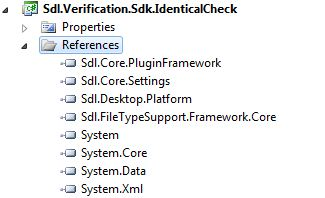
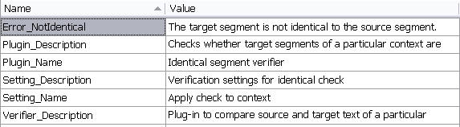

# Create a New Project

This chapter explains how to set up a project for developing a global verification plug-in.

## Creating the Project

Before developing plug-ins for Var:ProductName, make sure that the SDK is installed on your development computer. The SDK installer adds new templates to your Var:VisualStudioEdition environment, as shown in the screenshot below. For the type of plug-in discussed in this chapter, use the **Var:ProductName (2026)** project template.

By default, a project created from this template is named, for example, **Trados Studio1**. Rename the project to **Sdl.Verification.Sdk.IdenticalCheck** for this sample implementation.

## Adding the Required References

The plug-in template includes the **Sdl.Core.PluginFramework.dll** reference. For the global verifier implementation, you also need to reference the Verification API, i.e. **Sdl.Verification.Api.dll**. To implement the functionality in this example, add the following libraries used for integration with `Var:ProductName`:

- **Sdl.Desktop.Platform.dll**
- **Sdl.FileTypeSupport.Framework.Core**
- **Sdl.Core.Settings.dll**

These files are typically located in the installation folder of `Var:ProductName`, i.e. *Var:InstallationFolder*. Ensure that the `Copy Local` property for these references is set to `True`.

> [!NOTE]
> Remember to sign the assembly. Otherwise, your plug-in might not be loaded by Var:ProductName.

## Adding the Resources File

The project template includes a **PluginResources.resx** resources file, which stores strings and plug-in UI elements, such as the plug-in name and the message texts for any problems that the plug-in reports. These elements are displayed in the user interface of Var:ProductName.

By default, this resources file only includes the **Plugin_Name** string. In our implementation, we need several other strings, such as those for setting the plug-in description and the error messages that the plug-in should display after verification. The resources table should look as follows:

The [Sdl.Verification.Sdk.IdenticalCheck](https://github.com/RWS/trados-studio-api-samples/tree/master/Verification/Sdl.Verification.Sdk.IdenticalCheck) sample project folder also contains an icon file (**icon.ico**), which you can add to the resource file of your project. This icon will be displayed next to the plug-in name in the **Options** dialog box.

