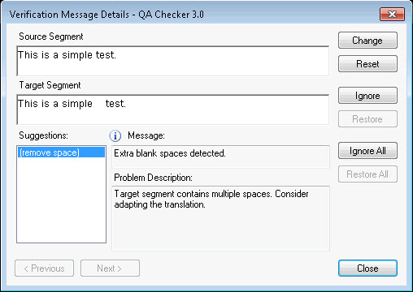

## Edit Segment and Apply Changes to Document

This section provides the information needed to implement code that allows users to edit a segment and apply those changes back to the document without exiting the "Verification Message Details" dialog box.

### Introduction
A user can make changes to segment content beyond the suggestions provided by the segment verifier and apply those changes to the document without closing the segment verifier dialog.

An edit control is available to make these changes. An event is fired by the control whenever the segment is edited. If the user edits the control, this content is used instead of the one coming from the suggestion.

A reset button is available to users to revert their changes.

The figure below shows the dialog box for the QA Checker verifier with the edit control (Target segment) and the suggestions control. It also shows the Change and Reset buttons.

To change the behavior of this control, implement the [ISegmentChangedAware](../../api/verification/Sdl.Verification.Api.ISegmentChangedAware.yml) interface.

For a complete example using the QA Checker verifier, see [CustomMessageControl](https://github.com/RWS/trados-studio-api-samples/blob/master/Verification/Sdl.Verification.Sdk.EditAndApplyChanges.MessageUI/CustomMessageControl.cs) in the **Sdl.Verification.Sdk.EditAndApplyChanges.MessageUI** project for a complete implementation description.
