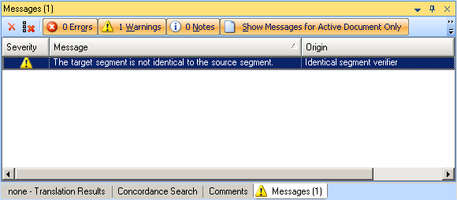

Introduction to Custom Message Controls
=====
Custom message controls can be developed to control how verification messages are displayed in <Var:ProductName>.

<Var:ProductName> Messages
----
<Var:ProductName> has a Messages window that contains any messages including those generated during verification.

Default Message Control
---
Double-clicking on a verification message in the Messages window shows the Verification Message Details form.

In this screenshot, the default message control, highlighted in red, has been used to display the verification message. The default message control provides general information about a verification message but the default message control cannot provide any information that is specific to the verification message.

Custom Message Control
----
Custom message controls can be developed to show verification messages providing specific information. Custom message controls can also suggest a change to the document to fix the verification message. If a custom message control suggests a change then the Change button becomes enabled. When the user clicks on the Change button the suggested change is applied to the document.