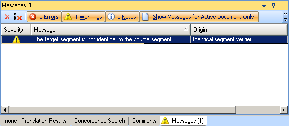

## Introduction to Custom Message Controls
Custom message controls allow you to customize how verification messages are displayed in Var:ProductName.

## Var:ProductName Messages
The Messages window in Var:ProductName displays all messages, including those generated during verification.

## Default Message Control
Double-clicking a verification message in the Messages window opens the Verification Message Details form.

The screenshot highlights the default message control in red. It provides general information about a verification message but lacks details specific to the message.

## Custom Message Control
Custom message controls can display specific details about verification messages. They can also suggest changes to resolve issues. When a suggestion is available, the Change button becomes enabled. Clicking the Change button applies the suggested change to the document.
