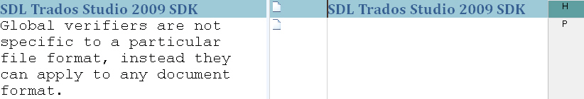

Introduction
=====

This guide will walk you through creating a C# project in Var:VisualStudioEdition to implement a simple global verification plug-in.

Global verifiers are not specific to a particular file format. Instead, they can apply to any document type that is localized in Var:ProductName.

Out-of-the-box, Var:ProductName is currently equipped with two global verification plug-ins, the **QA Checker** and the **Terminology Verifier**. These plug-ins can be found in the **Options** dialog box under **Verification** (i.e. *not* under **File Types**, as would be the case for file type-specific bilingual or native verification plug-ins). The global plug-ins can be enabled or disabled using the check boxes, which you can find next to the corresponding plug-in name.

For the global verifier that we would like to develop in this sample project, imagine the following scenario: Suppose that you need to process documents where text that occurs within a particular context must stay untranslated. For example, the target text for all headlines must be identical to the source segments. To facilitate the task of checking whether such segments have been taken over from the source text unchanged, you need to develop a global verification plug-in. This verifier is supposed to report all segments of a particular context (e.g. H for Heading) that differ from the original segments. To allow for flexibility, you need to be able to change the context that the verification applies to at runtime.

The Visual Studio sample project can be found in the sub-directory **Sdl.Verification.Sdk.IdenticalCheck** of the SDK samples folder.
