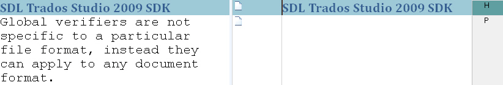

# Introduction

This guide explains how to create a C# project in `Var:VisualStudioEdition` to implement a simple global verification plug-in.

## What are global verifiers?

Global verifiers are not specific to a particular file format. Instead, they can apply to any document type localized in `Var:ProductName`.

By default, `Var:ProductName` includes three global verification plug-ins:

- **QA Checker**
- **Tag Verifier**
- **Terminology Verifier**

These plug-ins are available in the **Options** dialog box under **Verification** (not under **File Types**, which is used for file type-specific bilingual or native verification plug-ins). You can enable or disable the global plug-ins using the check boxes next to each plug-in name.

## Sample scenario

Suppose you need to process documents where text in a specific context must remain untranslated. For example, all headlines in the target should remain identical to the source segments. To support this workflow, you can create a global verification plug-in that reports all segments of a selected context (for example, `H` for Heading) that differ from the original segments. For flexibility, the context used for verification should be configurable at runtime.

## Sample project location

The Visual Studio sample project for this scenario is located in the [Sdl.Verification.Sdk.IdenticalCheck](https://github.com/RWS/trados-studio-api-samples/tree/master/Verification/Sdl.Verification.Sdk.IdenticalCheck)