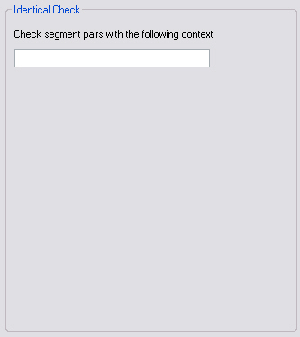

## Implement the User Interface

This chapter explains how to implement the user interface of your plug-in.

### Add a User Control

Implement the graphical user interface by adding a user control, which you can name, for example, `IdenticalVerifierUI.cs`. This is the interface that users see when configuring the verifier in Var:ProductName through **Tools** > **Options** > **Verification**. Our global verifier uses only one text field. Here, users can enter the display code of the context (for example, **H** for headline) to which the identical check should be applied. Add a text field to the user control and name it, for example, `txt_Context`.



### Implement the User Control Code

Switch to the code view of the user control, and add the following property to the class. This property is used for data binding of the value entered into the text field (or the value retrieved from it):

# [C#](#tab/tabid-1)
```cs
// Data binding for the text field control
public string ContextToCheck
{
    get
    {
        return this.txt_Context.Text;
    }
    set
    {
        txt_Context.Text = value;
    }
}
```
***

Putting it All Together
-----
The complete `IdenticalVerifierUI` class should now look as shown below:

# [C#](#tab/tabid-2)
```cs
using System.Windows.Forms;

namespace Verification.Sdk.IdenticalCheck
{
    public partial class IdenticalVerifierUI : UserControl
    {
        #region text field control
        // Data binding for the text field control
        public string ContextToCheck
        {
            get
            {
                return this.txt_Context.Text;
            }
            set
            {
                txt_Context.Text = value;
            }
        }
        #endregion

        public IdenticalVerifierUI()
        {
            InitializeComponent();
        }
    }
}
```
***
