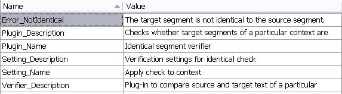

The Resources File
======
The project template includes a **PluginResources.resx** resources file, which stores strings and plug-in UI elements (e.g. the plug-in name, the message texts for any problems that the plug-in reports) that are displayed in the user interface of Trados Studio 2017.

By default, this resources file only includes the **Plugin_Name** string. In our implementation we need a number of other strings, e.g. to set the plug-in description and the error message(s) that the plug-in should display after verification. The resources table should therefore look as shown below:

The `Sdl.Verification.Sdk.IdenticalCheck` sample project folder also contains an icon (**icon.ico**) file, which you can add to the resource file of your project. This is the icon that will be displayed next to the plug-in name in the **Options** dialog box.