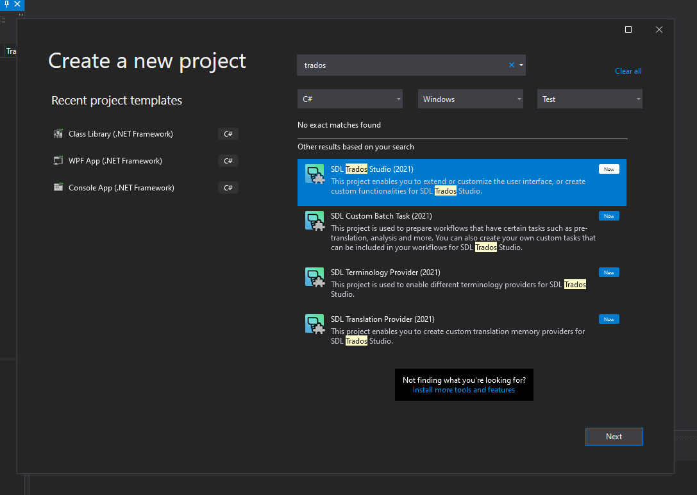
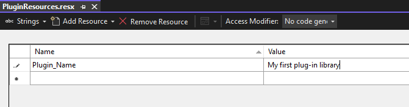

# Building a plug-in
This section explains how to create a third-party plug-in for Var:ProductName using a standard Visual Studio project template and describes how the process works under the hood.

## Building a Plug-in
Var:ProductName requires Microsoft .NET Framework 4.8 for third-party plug-in development. The Var:ProductName SDK includes several Visual Studio project templates that provide a quick start for creating various types of plug-ins.

This topic creates a Translation Provider plug-in as an example and focuses on aspects common to all plug-in types.

First, ensure that you have followed the [Setting up a Developer Machine](setting_up_a_developer_machine.md) guide.

Start Visual Studio and click **New Project**. Select one of the available Var:ProductName project templates. If no Var:ProductName project templates appear, install the latest Var:ProductName SDK version from the developer hub.




The project templates already contain stubs for all the classes you need to implement.

First, open `PluginProperties.cs`, located next to the `AssemblyInfo.cs` file in the Properties folder. This file contains a single Plugin attribute that identifies the project as a plug-in. "Plugin_Name" refers to a resource string defined in `PluginResources.resx`.

# [C#](#tab/tabid-1)
```cs
[assembly: Sdl.Core.PluginFramework.Plugin("Plugin_Name")]
```
***

Open the `PluginResources.resx` file. It contains a string value called `Plugin_Name`.



This value defines the plug-in assembly name and defaults to the Visual Studio project name. Var:ProductName displays this name in the plug-in management dialog. Define all localizable strings referenced by plug-in attributes or extension attributes in `PluginResources.resx`. The build compiles this `.resx` file into a `.resources` file and deploys it outside the plug-in assembly, allowing the host application to access the information without loading the assembly.

Every third-party plug-in must be deployed as a Plug-in Package (*.sdlplugin). This OPC-based file format (essentially a ZIP file) bundles the plug-in assembly, manifest file, and resources file. The Visual Studio project templates included with the Var:ProductName SDK automatically generate a plug-in package during each build. The build process relies on the plug-in package manifest defined in `pluginpackage.manifest.xml`, which the project template provides.

[!code-xml[ReportXSLT](code_samples/pluginpackage.manifest.xml)]		

The plug-in package manifest defines some pieces of essential information:

* **PlugInName**: The friendly name of the plug-in. This name can differ from the one defined in `PluginResources.resx`, because a single plug-in package can contain multiple plug-ins.
* **Version**: The plug-in package version. The system uses this value to detect updated packages. For more information, see [Plug-in deployment](plugin_deployment.md).
* **Description**: A description of the plug-in package.
* **Author**: The name of the plug-in author.
* **RequiredProduct**: Specifies which product this plug-in supports. You must include the minimum version and can optionally include a maximum version. <br>
Setting the minimum version to *Var:VersionNumber.1* restricts installation to Var:ProductName SR1 and above.
* **Include**: A list of additional files to include in the plug-in package.

Every plug-in project must reference the following NuGet packages:

* [Sdl.Core.PluginFramework](https://www.nuget.org/packages/Sdl.Core.PluginFramework/): Provides the APIs for extension points.
* [Sdl.Core.PluginFramework.Build](https://www.nuget.org/packages/Sdl.Core.PluginFramework.Build/): Provides the plug-in manifest creation build step using the standard MSBuild extension mechanism. See [Plug-in manifest generator](xref:the_plugin_manifest_generator.md).

> [!NOTE]
> `Sdl.Core.PluginFramework.Build` is required only at build time.

Build the project and inspect the output folder. It contains the following:

* The plug-in assembly, `MyPlugin.dll`
* A **Plugins** folder, which contains:
    * The plug-in manifest, `MyPlugin.plugin.xml`, listing all extension classes the plug-in provides.
    * The neutral plug-in resources file, `MyPlugin.plugin.resources`, containing all localizable strings and images referenced in the plug-in manifest. The build compiles this from `PluginResources.resx`.
* The plug-in package, `MyPlugin.sdlplugin`, bundling all of the above together with the plug-in package manifest.

After adding all the relevant information, build the project. Find the plug-in at the local path *Var:PluginPackedPath* (unless you changed the default path).

If the console displays the error `Error 1 Failed to locate ResGen.exe and unable to compile plug-in resource file...`, install [.NET Framework 4.8](https://dotnet.microsoft.com/en-us/download/dotnet-framework/net48).

You can now deploy the plug-in package in Var:ProductName. See [Plug-in deployment](plugin_deployment.md).
