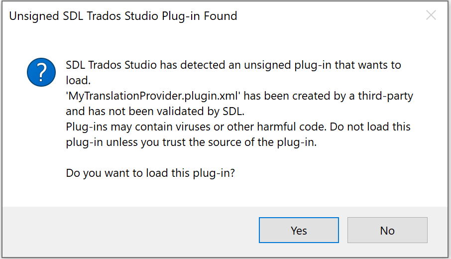
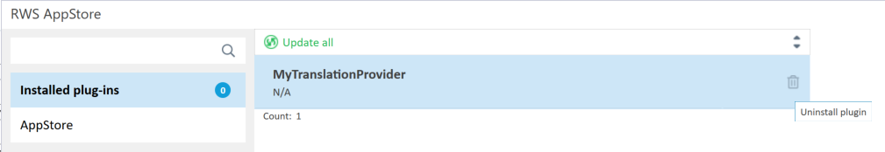

# Plug-in Deployment

This guide explains how to deploy, update, and uninstall a Plug-in Package (*.sdlplugin) for use in Var:ProductName. It provides step-by-step instructions to ensure a smooth process for developers.

## How to Install a Plug-in Package
1. Locate the plug-in package file (*.sdlplugin) on your system.
2. Double-click the file to launch the installation wizard.
3. Follow the on-screen instructions to complete the installation.

> [!NOTE]
>
> During development, you can configure the output path of the project to point to *Var:PluginPackedPath*. This is already configured if you created the project with one of the project templates available in the **Var:ProductName SDK** here. For more information on this, see [Setting up a Developer Machine](setting_up_a_developer_machine.md).

When Var:ProductName starts, you may see the following warning message:

To prevent this warning, submit your plug-in package to RWS for verification. Send an email to **Var:AppSigningEmail** with a link from where the plug-in can be downloaded for verification. Once the verification is complete, you will receive an email with a download link where you can obtain the signed version of the plug-in. After signing, the warning will no longer appear.

Once Var:ProductName has started, go to the **Tools > Plug-ins** dialog and notice that "MyPlugin" is now listed as a plug-in and is ready to be used.

## Steps to Update a Plug-in Package
1. Open the plug-in package manifest and increase the version number.
2. Save the changes and rebuild the plug-in package.
3. Double-click the updated plug-in package to launch the installation wizard.
4. Start Var:ProductName. The application will detect the updated plug-in package, verify it, extract its contents into <em>Var:PluginUnpackedPath</em>, and load it.

> [!NOTE]
>
> Make sure to update the version number in the plug-in manifest; failing to do so will prevent the update from being applied.

## How to Uninstall a Plug-in Package
To uninstall a plug-in, choose one of the following methods:

1. **Using the Plugin Manager**:
   - Open the Plugin Manager installed with Var:ProductName.
   - Select the plug-in you want to uninstall and follow the prompts.

2. **Using RWS AppStore Integration**:
   - Open Var:ProductName and navigate to the RWS AppStore Integration.
   - Locate the plug-in and uninstall it.

