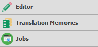

# Plugin use cases for Var:ProductName

## Create new Var:ProductName features

### [MSWord Grammar Checker](https://appstore.rws.com/Plugin/84)

This app adds grammar checking capability to SDL Trados Studio by integrating the grammar checking feature of MS Word into the editor view.

### [Glossary Plugin](https://appstore.rws.com/Plugin/166)

As an extra feature in the ribbon, this plug-in allows users to add terminology to projects in Var:ProductName with just a few clicks.

### [Jobs](https://appstore.rws.com/Plugin/32)

The Jobs plug-in adds a new view where users can find ProZ.com translation job posts online within Studio easily and quickly using search filters.

## Access external resources

<!-- TODO: Enable this content when it is added on AppStore
### [EU DocFinder]()

The EU created DocFinder, allowing users to highlight text within the editor and search a document repository to find matches for this text.
-->

### [Web Lookup!](https://appstore.rws.com/Plugin/4)

This app allows users to highlight a word or phrase to perform a web search on directly within Var:ProductName's translation editor environment.

<!-- TODO: Enable this content when it is added on AppStore
### [EU Cross-lingual concordance]()

Developed by the EU, their cross-lingual concordance search allows users to leverage work from other neighbouring languages to get the context of how a particular word/phrase is used
-->

## Integrate with apps and products

### [Post-Edit Compare](https://appstore.rws.com/Plugin/15)

Creating a brand new view in Var:ProductName, the Post-Edit Compare app provides a full analysis of Post-Editing work in an extensive report format.

<!-- TODO: Enable this content when it is added on AppStore
### [Content Connector]()

Content connector allows you to create projects instantly by dropping files into a set location - a great example of a project automation app.
-->

<!-- TODO: Enable this content when it is added on AppStore
### [Tilde Terminology](https://appstore.sdl.com/language/app/tilde-terminology-plugin/511/)

Built for Tilde users, it automatically analyses a source segment within Var:ProductName, identifies term candidates within it and looks up for translations on the fly.
-->
