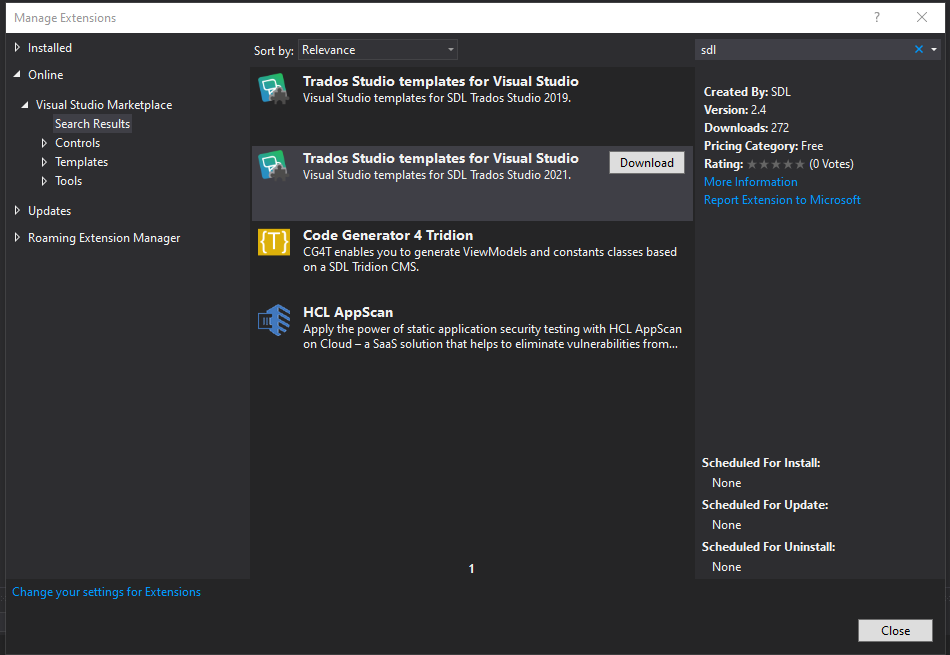

# Setting up a Developer Machine

Make sure you have the right prerequisites and meet the system requirements to develop applications that leverage the Var:ProductName public APIs.

## Prerequisites

* For the development environment, we recommend using Var:VisualStudioEdition.

* If you develop against a version of the API distributed with one of RWS's publicly released applications (i.e. Var:ProductNameWithEdition), all required assemblies and files should be available alongside the application.
  Make sure you have the latest release of Var:ProductName installed.

* We also recommend installing the **Var:ProductName SDK** on your machine.
  After installing the **Var:ProductName SDK**, the **New Project** dialog box in Var:VisualStudioEdition displays additional project templates specific to Var:ProductName application development.
  * You can get the latest version from the [public repository](https://github.com/RWS/trados-studio-vs-extension).
  * Or you can install directly from Var:VisualStudioEdition -> Tools -> Extensions.

  

> [!NOTE]
>
> As the build output path for your implementations, choose Var:PluginPackedPath.
>
> Also verify that your library references point to the Var:ProductName folder, e.g. Var:InstallationFolder.
>
> For more information on how to build and deploy a Studio plug-in, see [Building a plug-in](building_a_plugin.md) and [Plug-in deployment](plugin_deployment.md).
>
> Sign and use Strong-Named Assemblies to enable loading of your plug-ins inside Var:ProductName. For more information, see [How to: Sign an Assembly with a Strong Name](https://learn.microsoft.com/en-us/dotnet/standard/assembly/sign-strong-name).
> If you don't have a key, you can download the [SdlCommunity.snk](https://github.com/RWS/Sdl-Community) key from the public repository.
>
> Choosing a different build output path or not signing your assembly prevents Var:ProductName from loading your plugin.

## Platform support

The Var:ProductName API targets 64-bit components.
Set your application's platform target to `x64` to ensure compatibility.

If your application also needs to support 32-bit platforms, note that the Var:ProductName API does not support running in 32-bit mode.

## System requirements for running Var:ProductNameWithEdition

* A Microsoft Windows-based PC or an Intel-based Apple Mac computer running Windows as an operating system.
  Var:ProductNameWithEdition runs on the latest build of Windows 11 and the latest updated version of Windows 10.
* Up to 2.5 GB of available disk space to run the Var:ProductNameWithEdition installer.
* 2 GB of available disk space to run Var:ProductNameWithEdition.
* A recent processor with dual or multi-core technology.
* At least 8 GB RAM.
* Var:ProductNameWithEdition requires Microsoft .NET Framework 4.8.
* Additional details can be found in the [product release notes](https://docs.rws.com/binary/980998/802650/trados-studio-2022/trados-studio-release-notes).

## System requirements for running Trados GroupShare (TM Server, MultiTerm, Project Server)

Supported operating systems:

* Windows Server 2025 with IIS 10 (compatible with Trados GroupShare 2020 SR2 and later)
* Windows Server 2022 with IIS 10 (compatible with Trados GroupShare 2020 SR1 CU6 and later)
* Windows Server 2019 with IIS 10
* Windows Server 2016 with IIS 10

Supported database servers:

* SQL Server 2022
* SQL Server 2019
* SQL Server 2017

Additional details can be found in the [product release notes](https://docs.rws.com/).