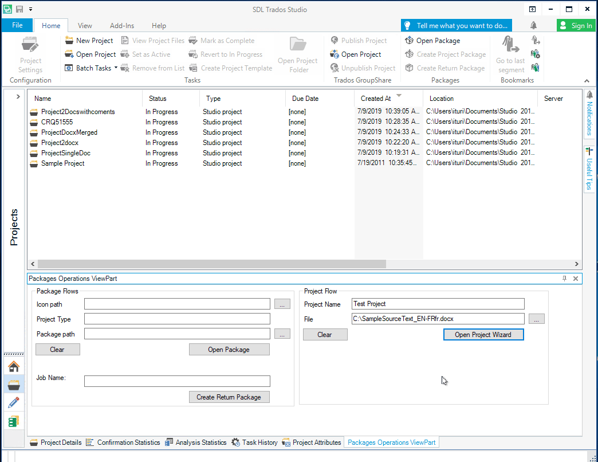
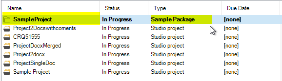

# Better Studio interactivity in day to day flows
Together with the release of Trados Studio 2019 SR2 we decided to make some improvements to our public APIs and give our 3<sup>rd</sup> Party developers more access to Studio's functional flows as well as user interface styling. Throughout this article we will present the functionality we exposed in our APIs and the means by which you can make the most out of it.
## Improved Notification System
The notification system in Trados Studio, which can be accessed via the Notification View pane (on the right-hand side), was intended as a mechanism allowing us to promote notifications in a non-intrusive manner, while translators interact with Studio. We continued to take advantage of it, but while developing new features, we realized  it had some short-comings that needed to be addressed. After we fixed the issues, we decided to make them available in the public APIs.

In order to allow translators to remove a specific notification, we introduced two new properties on the `IStudioNotification` interface. As developers, you will have full control over which notifications can be removed by translators and which not, as well as over what should happen within the remove logic.

| Property        | Type           | Purpose  |
| ------------- |:-------------| -----|
| `AllowsUserToDismiss`| `bool` | Set this to *true* for the user to see a *dismiss* button when hovering over a notification. |
| `ClearNotificationAction`| `IStudioNotificationCommand`      |   Assign an instance of the implemented interface to this property. The *dismiss* button will trigger the behavior specified in your implementation. |

We also enhanced the control over the notification system by exposing additional events. With the help of these events we now give full access to creating and removing notification groups, but also to what happens inside a group: remove a notification from a group, add a specific notification to a group or create that group if it does not exist.

| Event        |  Purpose  |
| ------------- | -----|
| `AddStudioNotificationOrCreateGroupEvent`| Trigger this event to add an `IStudioNotification` instance to an existing group or create a new group if the group with the given key already exists. The event expects the unique identifier of the group, the notification to be added and a group title in case it needs to create a new group.|
| `RemoveStudioNotificationFromGroupEvent` | Trigger this event via the **EventAggregator** to remove a specific notification identified by its unique id from the group with the given key. |

The following code snippet demonstrates how to publish dismissible notifications via the `IStudioEventAggregator`

```cs
    //create a unique identifier for the notification
    var notificationId = Guid.NewGuid();
    //create an instance of IStudioNotification
    var sampleNotification = new StudioTestNotification(notificationId)
    {
        Title = "Sample Notification Title",
        AlwaysVisibleDetails = new List<string> 
        { 
            "Will be added to an existing group or will create a new one." 
        },
        AllowsUserToDismiss = true,
        ClearNotificationAction = new ClearNotificationAction(GroupId, notificationId),
        IsExpanderVisible = false,
        IsLinkVisible = true,
        LinkAction = new OpenLinkCommand("https://appstore.sdl.com/language/developers/sdk.html")
        {
            CommandText = "Learn more on the Studio 2019 SDK",
            CommandToolTip = "Learn more on the Studio 2019 SDK"
        },
        IsActionVisible = false
    };

    //create an instance of the event
    var addTestGroup = new AddStudioNotificationOrCreateGroupEvent(
                                GroupId, 
                                sampleNotification, 
                                NotificationGroupTitle);
    //publish the event via the Event Aggregator
    var ea = SdlTradosStudio.Application.GetService<IStudioEventAggregator>();
    ea.Publish(addTestGroup);
```
The `ClearNotificationAction` class implements the logic required to remove the notification from the group. It implements the `IStudioNotificationCommand` interface which is just an extension over the standard WPF `ICommand`.

```cs
public class ClearNotificationAction : IStudioNotificationCommand
{
    private readonly string _groupId;
    private readonly Guid _notificationId;

    public ClearNotificationAction(string groupNotificationKey, Guid notificationId)
    {
        .......//some constructor logic
    }

    ....... //Interface implementation (properties and methods)       
        
    public void Execute(object parameter)
    {
        var ea = SdlTradosStudio.Application.GetService<IStudioEventAggregator>();
        ea.Publish(new RemoveStudioNotificationFromGroupEvent(_groupId, _notificationId));
    }
}
```
If you are unclear about which properties need to be set in order to control various UI elements and inject custom behavior, we created a diagram mapping the elements of a **Notification Group** and a **Notification** to the properties of the `IStudioNotificationGroup` and `IStudioNotification` interfaces.


## Improved interactivity with projects
In this section we will present some of the new API events and interfaces that we exposed to help your plugins integrate better with Trados Studio's project and package flows. 

#### Accessing the ***New Project*** wizard

With Studio 2019 SR2 you can now request for **New Project** wizard to be opened from your code by publishing the `OpenNewProjectWizardEvent` via the `IStudioEventAggregator`. This event will also allow you to pre-specify data for the new project in a `ProjectWizardData` object.

| Property        |  Description  |
| -------------  | -----|
| `ProjectName` | Use this property to pre-set a value for your project name.|
| `Content` | Use this enumeration to send a list of files or folders given by their full path. |
| `ProjectTemplate` | Set this property to the full path of a project template file (*.sdltpl) that will be used by the wizard for creating the project. |
| `ProjectReference` | Set this property to the full path of a project file (*.sdlproj) that will be used by the wizard for creating the project. |

Please note that you can either pass a project template or a project reference template. In the event you pass values for both, Trados Studio will use the project template file.

Here is a small code sample on how to implement the event publishing:
```cs
var wizardData = new ProjectWizardData()
{
    ProjectName = "My Project",
    Content = new List<string>() { "C:\MySample.doc" }
};
_eventAggregator.Publish(new OpenNewProjectWizardEvent(wizardData));
```

And this is how it should behave in Studio:



#### Executing custom logic within package flows

Up until Studio 2019 SR2 the only option you had to invoke the **Open Package** wizard  from a plugin was similar to this:
```cs
 var app = new StudioApplication();
 app.ExecuteAction<OpenPackageAction>();
```
Going forward, you will now be able to trigger the same **Open Package** wizard and pass along additional details such as the package file path, the project icon and even a custom job to be executed after the package is imported in Studio. Same as above, all you need to do is publish an `OpenProjectPackageEvent` object with your desired data.



| Property        |  Description  |
| -------------  | -----|
| `packageFilePath` | Use this parameter to specify a path to the package to be opened.|
| `job` | Use this parameter to pass an `IExternalJobWithProgress` object to be executed once the package was loaded in Studio. Leave this `null` if you do not wish to execute a custom job.  |
| `iconPath` | Use this parameter to set an icon for your project. This allows you to customize the Projects View and have project icons specific to your plugin. |
| `projectOrigin` | Use this parameter to set a project type. This allows you to customize the Projects View and have the project type specific to your plugin. |


Here is a code sample from the above capture. The details on how to implement a custom job will be presented later on in this article.
```cs
  var sampleJob = new SampleJob() { JobName = "Sample" };
  eventAggregator.Publish(new OpenProjectPackageEvent(packagePath, sampleJob, iconPath, projectType));
```

The same improvements were added for creating return packages, where you can specify a custom job to be executed when triggering the **Create Return Package** wizard. You might find these usefull if your plugin needs to upload the package to a server, as everything will be processed together within the wizard. To achieve this, publish the `CreateReturnPackageEvent` using the `IStudioEventAggregator`.

| Property        |  Description  |
| -------------  | -----|
| `id` | This is the project `Guid` which you can obtain from the `ProjectInfo` class.|
| `job` | Use this parameter to pass an `IExternalJobWithProgress` object to be executed once the return package was created. Leave this `null` if you do not wish to execute a custom job.  |


And this is the code sample:
```cs
var sampleJob = new SampleJob() { JobName = "Sample" };
var project = SdlTradosStudio.Application.GetController<ProjectsController>().CurrentProject;
if (project != null)
{
    var selectedProjectId = project.GetProjectInfo().Id.ToString();
    eventAggregator.Publish(new CreateReturnPackageEvent(selectedProjectid, sampleJob));
}
```
The `IExternalJob` and `IExternalJobWithProgress` interfaces are the bridge that will allow you to inject custom code into the wizards as well as into Trados Studio's job mechanism. This gives you the advantage to achieve the same look and feel for long processing jobs besides helping you complete your work faster. Once you have an implementation ready all you need to do is publish  `ExecuteExternalJobEvent` using `IStudioEventAggregator`. As a result, Trados Studio will pick the job and execute it on a background thread or inject it into the previously-mentioned events. If the job is cancelled for any reason, you can handle that from the `JobCanceled` method.

| Interface        |  Purpose  |
| ------------- | -----|
| `IExternalJob`| Implement this interface when you want to run a long processing job. The logic will be automatically executed on a background thread.|
| `IExternalJobWithProgress` | Implement this interface when you want to run a long processing job that can also report progress to the user. Triggering the `ProgressReported` event handler will allow you to report progress on the execution of your job to the user. |

Here is a code sample on how such an implementation should look like:

```cs
public class SampleJob : IExternalJobWithProgress
{
    //Use this property to hold any type of data required for your job
    public object JobData { get; set; }

    public string JobName { get; set; }

    public event EventHandler<JobProgressArgs> ProgressReported;

    public void JobCanceled(object sender, EventArgs e)
    {
        //Job canceled...do something
    }

    public void Execute()
    {
        ProgressReported?.Invoke(this, new JobProgressArgs()
        {
             PercentComplete = 0,
             StatusMessage = "Sample Job started"
        });
        
        //some long running operation
        ProgressReported?.Invoke(this, new JobProgressArgs()
        {
            PercentComplete = 100,
            StatusMessage = "Sample Job done"
        });
    }
}
```
> Please note that the `JobData` property acts as a bridge between Trados Studio and your plugin in case of using the job inside the **Open Package** and **Create Return Package** wizards. Trados Studio will set the file path on the property as follows:
> - the file path to the project that was just imported into Trados Studio, in the case of the **Open Package** wizard
> - the file path for the created package, in the case of the **Create Return Package** wizard.

## Other improvements

In this section we will present some additional changes which we consider useful for plugin development.

#### Knowing when the Trados Studio main window was created
There are situations when you want to know when your application has completed loading in order to perform a specific user operation. For example, you want to display a log-in prompt for the translators from your plugin. For such a scenario (but not only), we exposed the `StudioWindowCreatedNotificationEvent` which will be published from Trados Studio once it completes loading. Now you only need to subscribe to this event and you are set to go. 

```cs
    protected override void Initialize(IViewContext context)
    {
        var ea = SdlTradosStudio.Application.GetService<IStudioEventAggregator>();
        ea.GetEvent<StudioWindowCreatedNotificationEvent>().Subscribe(OnStudioWindowCreated);
    }

    private void OnStudioWindowCreated(StudioWindowCreatedNotificationEvent e)
    {
        MessageBox.Show("Studio was loaded");
    }
```
#### Refreshing the Projects view
For situations where you would like to have the list of Trados Studio projects refreshed in the Projects view you can now publish a `RefreshProjectsEvent` object via the event aggregator.

```cs
   eventAggregator.Publish(new RefreshProjectsEvent());
```


With this we bring to an end our improvements for Studio 2019 SR2 public APIs. You can find more code examples on [GitHub](https://github.com/sdl/trados-studio-api-samples), and make sure to checkout our other article on the exposed WPF Styles (link to Andrea's article).