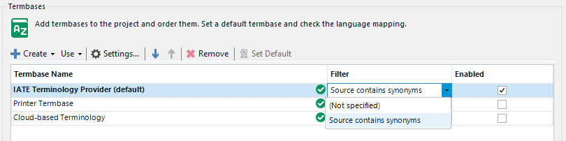
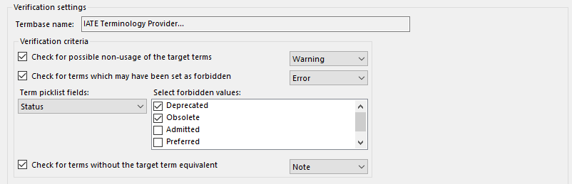

# How to update plugins to <var:ProductNameWithEdition> SR2

There will be significant changes to the Terminology provider API with the release of <var:ProductNameWithEdition> SR2.  These changes are all geared towards decoupling the Multiterm integration from <var:ProductName> to promote independent development cycles and reduce the risk of compatibility issues. This means that updates, bug fixes, and new features can be developed and released separately and lead to faster development cycles for each product.

Unfortunately, this will introduce breaking changes for plugin and project automation integrations with the Terminology provider API. The following are a list of changes and known issues to consider when updating your plugin to be compatible with <var:ProductNameWithEdition> SR2

## Terminology Provider API

Make reference to the [release notes](https://developers.rws.com/studio-api-docs/apiconcepts/releasenotes/tradosstudio2022sr2.html) for <var:ProductNameWithEdition> SR2 when updating your plugin integrations with the Terminology Provider API. It includes all of the API changes that will facilitate better management, customization, and extensibility of terminology providers, providing more flexibility and control for developers and users. 
- **Removed Classes and Interfaces**: Several classes and interfaces have been removed, such as _AbstractTerminologyProvider_, _IDefinition_, _IDefinitionLanguage_, and others.
- **Updated Classes**: Major changes include the Definition class, _Entry_, _EntryField_, _EntryLanguage_, and others. These updates involve changes in property types, constructors, and interfaces.
- **TerminologyProviderManager**: Now implements _ITerminologyProviderManager_, offering new methods for managing terminology providers, such as _RemoveTerminologyProvider_.
- **ITerminologyProvider Updates**: The _ITerminologyProvider_ interface has several new properties and methods for managing active filters, initialization, and more. The type of returned values for methods like _GetEntry_ and _Search_ has changed.
- **New Interfaces**: Several new interfaces have been added, including _ITerminologyProviderManager_, _ITerminologyProviderWinFormsUIWithCreate_, and _ITerminologyProviderWinFormsUIWithEdit_.

**Note:** A full integration of these new changes to the Terminology Provider API are available from the [IATE Terminology Provider project](https://github.com/RWS/Sdl-Community/tree/master/IATETerminologyProvider) for reference.

## ITerminologyProvider

The *AbstractTerminologyProvider* is no longer available & in its place you must implement the *ITerminologyProvider* interface, which has some new properties & methods such as *ActiveFilter* property & associated method *GetFilters()* that enable a user to add filters to restrict the results that provider displays when searching a termbase during translation.

```cs
public class MyTerminologyProvider : ITerminologyProvider
{
    public FilterDefinition ActiveFilter { get; set; }
 
    public IList<FilterDefinition> GetFilters()
    {
        var filterDefinitions = new List<FilterDefinition>();
        var filterDefinition = new FilterDefinition 
                                { ID = 0, Name = "Source contains synonyms" };
        filterDefinitions.Add(filterDefinition);
 
        return filterDefinitions;
    }
}
```

### Terminology Provider Type
Set the *Type* to *TerminologyProviderType.Custom* for Third-party terminology providers
```cs
public class MyTerminologyProvider : ITerminologyProvider
{
    public TerminologyProviderType Type => TerminologyProviderType.Custom;
}
```

### Definition
Its important to fully describe the *DescriptiveFields* to the *Definition* property of the provider to provide sufficient information when integrating with other services, such as the **Terminology Verifier**.  For example: to enable integration with the feature to check for forbidden terms, you should include the *DescriptiveField* at the *TermLevel*, as shown here:

```cs
public class MyTerminologyProvider : ITerminologyProvider
{
    public Definition Definition => new Definition(GetDescriptiveFields(), 
                                                    GetDefinitionLanguages());
 
    public IList<DescriptiveField> GetDescriptiveFields()
    {
        var result = new List<DescriptiveField>();
 
        var definitionField = new DescriptiveField
        {
            Label = "Definition", Level = FieldLevel.EntryLevel, 
                                    Mandatory = true, Multiple = true,
            Type = FieldType.String
        };
        result.Add(definitionField);
 
        var statusField = new DescriptiveField
        {
            Label = "Status", Level = FieldLevel.TermLevel, 
                                Mandatory = false, Multiple = true,
            Type = FieldType.PickList,
            PickListValues = 
                new[] { "Deprecated", "Obsolete", "Admitted", "Preferred", "Proposed" }
        };
        result.Add(statusField);
 
        return result;
    }
}
```
```cs
public IList<DefinitionLanguage> GetDefinitionLanguages()
{
    var result = new List<DefinitionLanguage>();
 
    var currentProject =  SdlTradosStudio.Application?.
                            GetController<ProjectsController>()?.CurrentProject;
    if (currentProject == null) return result;
 
    var projectInfo = currentProject.GetProjectInfo();
 
    result.Add(new DefinitionLanguage
    {
        Locale = projectInfo.SourceLanguage.CultureInfo,
        Name = projectInfo.SourceLanguage.DisplayName
    });
 
    result.AddRange(
    projectInfo.TargetLanguages.Select(language => new DefinitionLanguage
    {
        Locale = language.CultureInfo,
        Name = language.DisplayName
    }));
 
    return result;
}
```

## ITerminologyProviderWinFormsUI

You will noticed that the property *SupportsEditing* & the method *Edit(IWin32Window owner, ITerminologyProvider terminologyProvider)* have been removed from the *ITerminologyProviderWinFormsUI* interface.  If your provider allows a user to edit the provider settings by displaying a settings dialog, then implement the new interface *ITerminologyProviderWinFormsUIWithEdit*. Additionally, the new interface *ITerminologyProviderWinFormsUIWithCreate* introduces a new extensibility point that will display a context menu item in the **Create** button from the Terminology Provider Settings in <var:ProductName>.  This is useful for use cases where the creation of the provider needs to be a separate to the edit settings dialogs.
```cs
[TerminologyProviderWinFormsUI]
public class MyTerminologyProviderWinFormsUI : ITerminologyProviderWinFormsUIWithEdit, 
                                               ITerminologyProviderWinFormsUIWithCreate
{
    public ITerminologyProvider Create()
    {
        // Adds the capability to create a ITerminologyProvider.
        // Allows the creation of an ITerminologyProvider from the UI. 
        // It returns a ITerminologyProvider
        return null;
    }
 
    public bool Edit(IWin32Window owner, ITerminologyProvider terminologyProvider)
    {
        // Adds the capability to edit settings.
        // Used to display a dialog to interactively change the provider settings.
        return true;
    }
 
    public ITerminologyProvider[] Browse(
              IWin32Window owner, ITerminologyProviderCredentialStore credentialStore)
    {
        // Adds the capability to select a ITerminologyProvider.
        // Used to display a dialog to add a new terminology provider.
        return null;
    }
}
```

## Plugin Manifest

The manifest file **pluginpackage.manifest.xml** is located at the root of your project solution.  The values of the **RequiredProduct** should be updated to align with the latest release.

### RequiredProduct

- Min version should be set to: 17.2. If your plugin has been updated to support these latest changes to the Terminology Provider API, then you should reflect this by setting the minimum supported version of your plugin to 17.2
- Max version should be set to 17.9. It is recommended to also set this value, as it will provide the AppStore with sufficient information in correctly identifying plugins that are compatible with the version of <var:ProductName> that is launched.
- Name should be set to: *TradosStudio*

Example
```xml
<?xml version="1.0" encoding="utf-8"?>
<PluginPackage xmlns="http://www.sdl.com/Plugins/PluginPackage/1.0">
  <PlugInName>My plugin name</PlugInName>
  <Version>1.1.0.0</Version>
  <Description>My plugin description</Description>
  <Author>Trados AppStore Team</Author>
  <RequiredProduct name="TradosStudio" minversion="17.2" maxversion="17.9" />
</PluginPackage>
```


## Known Issues
The following are a list of known issues and solutions that you might encounter depending on your settings and configuration:

### Trados.Community.Toolkit (formally SDL.Community.Toolkit)
A new version of the Trados Community Toolkit, version 4.1.1, has been released to support the latest version of <var:ProductNameWithEdition> SR2.  This includes the following assemblies:

- [Trados.Community.Toolkit.Core](https://www.nuget.org/packages/Trados.Community.Toolkit.Core)
- [Trados.Community.Toolkit.LanguagePlatform](https://www.nuget.org/packages/Trados.Community.Toolkit.LanguagePlatform)
- [Trados.Community.Toolkit.Integration](https://www.nuget.org/packages/Trados.Community.Toolkit.Integration)
- [Trados.Community.Toolkit.FileType](https://www.nuget.org/packages/Trados.Community.Toolkit.FileType)
- [Trados.Community.Toolkit.ProjectAutomation](https://www.nuget.org/packages/Trados.Community.Toolkit.ProjectAutomation)

### Dependency version changes
There is a list of known dependency version changes that may influence your integration with the latest <var:ProductNameWithEdition> SR2 APIs; this is typically seen from standalone applications that are running outside of the <var:ProductName> context.  To resolve these references, include the following binding redirects in the configuration file of the project.

``` xml
<?xml version="1.0" encoding="utf-8" ?>
<configuration>
  <startup>
    <supportedRuntime version="v4.0" sku=".NETFramework,Version=v4.8" />
  </startup>
  <runtime>
    <NetFx40_PInvokeStackResilience enabled="1" />
    <legacyCorruptedStateExceptionsPolicy enabled="true" />
    <ThrowUnobservedTaskException enabled="true" />
    <assemblyBinding xmlns="urn:schemas-microsoft-com:asm.v1">
      <dependentAssembly>
        <assemblyIdentity name="Microsoft.Extensions.DependencyModel" publicKeyToken="adb9793829ddae60" culture="neutral" />
        <bindingRedirect oldVersion="0.0.0.0-7.0.0.0" newVersion="7.0.0.0" />
      </dependentAssembly>
      <dependentAssembly>
        <assemblyIdentity name="System.Memory" publicKeyToken="cc7b13ffcd2ddd51" culture="neutral" />
        <bindingRedirect oldVersion="0.0.0.0-4.0.1.2" newVersion="4.0.1.2" />
      </dependentAssembly>
      <dependentAssembly>
        <assemblyIdentity name="Microsoft.Data.SqlClient" publicKeyToken="23ec7fc2d6eaa4a5" culture="neutral" />
        <bindingRedirect oldVersion="0.0.0.0-5.0.0.0" newVersion="5.0.0.0" />
      </dependentAssembly>
    </assemblyBinding>
  </runtime>
</configuration>
```