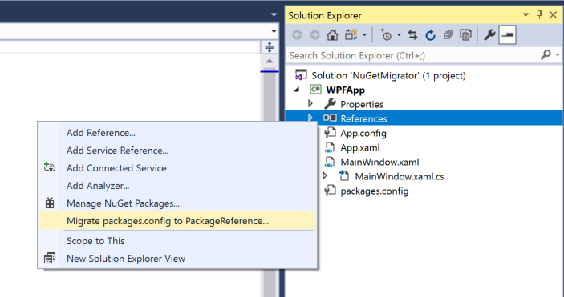
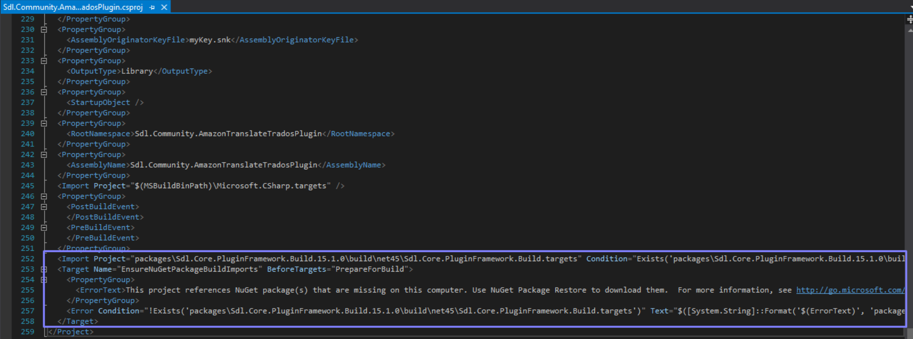

# How to update plugins to Trados Studio 2022

Plugins built for previous releases of Trados Studio are not compatible with Trados Studio 2022.  While the main reason for this is due to the assembly versions increased to align with the latest product release, there are also other breaking changes to take in to consideration. 

The following are a list of changes and known issues to consider when updating your plugin to be compatible with Trados Studio 2022.

> [!NOTE]
>
> In order to migrate a plugin to be compatible with Trados Studio 2022 we need to install:
> .NET Framework *4.8*. It can be installed form https://dotnet.microsoft.com/download/dotnet-framework/net48. After you install the framework a restart is required.

### How check if the .Net Framework was installed correctly
After restart, you can check if the version was installed correctly using Powershell (opened as Administrator) by typing following command.
```sh
gci ‘HKLM:\SOFTWARE\Microsoft\NET Framework Setup\NDP’ -recurse | gp -name Version -EA 0 | where { $_.PSChildName -match ‘^(?!S)\p{L}’} | select PSChildName, Version
```
Make sure that version *4.8* is displayed in the list.


<br/>

## Plugin Framework
The latest version of the plugin framework packages should be installed. You can add/update the plugin framework nuget packages in your project via the package manager user interface or console.
### Package Manager UI
* In **Solution Explorer**, right-click **References** and choose **Manage NuGet Packages**.
* Select nuget.org as the **Package source**.
* Search for `Sdl.Core.PluginFramework` from the **Browse** tab.
* Select the package from the list and click **Install** or **Update**.
  * `Sdl.Core.PluginFramework`, version _2.1.0_
  * `Sdl.Core.PluginFramework.Build`, version _16.1.0_
* Accept any license prompts to finnish the installation.


<br/>

## Plugin Manifest

The manifest file pluginpackage.manifest.xml is located at the root of your project solution.  The values of the `RequiredProduct` should be updated to align with the latest release.

<b>RequiredProduct</b>
* Min version should be set to: _17.0_
* Max version should be set to _17.9_.  It is recommend to also set this value, as it will provide the RWS AppStore with sufficient information in correctly identifying plugins that are compatible with the version of Trados Studio that is launched.
* Name should be set to: _TradosStudio_
 
**Example:**

~~~xml
<PluginPackage xmlns="http://www.sdl.com/Plugins/PluginPackage/1.0">
  <PlugInName>My plugin name</PlugInName>
  <Version>1.1.0.0</Version>
  <Description>My plugin description</Description>
  <Author>My author name</Author>
  <RequiredProduct name="TradosStudio" minversion="17.0" maxversion="17.9" />
</PluginPackage>
~~~


<br/>

## Project References & Deployment Path
The following changes should be applied in the project file (.csproj)

All Trados Studio references should point to the new installation path *$(ProgramFiles)\Trados\Trados Studio\Studio17*. For example:

~~~xml
<Reference Include="Sdl.Desktop.IntegrationApi.Extensions">
  <HintPath>$(ProgramFiles)\Trados\Trados Studio\Studio17\Sdl.Desktop.IntegrationApi.Extensions.dll</HintPath>
</Reference>
~~~

The plugin deployment path should point to the new location *$(AppData)\Trados\Trados Studio\17\Plugins*.  For example:

~~~xml
<PluginDeploymentPath>$(AppData)\Trados\Trados Studio\17\Plugins</PluginDeploymentPath>
~~~

> [!NOTE]
>
> To update settings directly in the project file from Visual Studio
> * Right-click on the project node in the **Solution Explorer** and select **Unload Project**.
> * Then, right-click on the project and choose *Edit* <projectname>
> 
> Once you have applied your changes in the project file, then reload project
> * In the **Solution Explorer**, select the projects you want to load (press **Ctrl** while clicking to select more than one project)
> * Then right-click on the project and choose **Reload Project**.

<br/>
***
<br/>

## Known Issues
The following are a list of known issues and solutions that you might encounter depending on your settings and configuration

### Project Reference, Private = false issue
We have discovered a new symptom while building plugins with the latest plugin framework against Trados Studio 2022. If the reference option (private = false) is present in the Trados Studio assembly reference of the project, then the plugin will not be built correctly. 

You will noticed that the API extension context is missing from the *.plugin.xml file. This is needed by the desktop platform to recognize and load the plugin in the studio context.

**Solution**

Remove this declaration or setting its value to true (default) will resolve the problem.

**Example**

The option declaration `<Private>False</Private>` in the following example should be removed, or set to true

~~~xml
<Reference Include="Sdl.Desktop.IntegrationApi.Extensions">
    <Private>False</Private>
    <HintPath>$(ProgramFiles)\Trados\Trados Studio\17beta\Sdl.Desktop.IntegrationApi.Extensions.dll</HintPath>
</Reference>
~~~

<br/>

### Migrate packages.config to PackageReference
If you project is still using a packages.config file to reference the nuget packages, then we need to migrate it to PackageReference from the visual studio solution.  Right-click on the **packages.config** file from the project solution and select **Migrate packages.config to PackageReference...** from the context menu.


<br/>

### Remove redundant references to the plugin framework
Unload the project from visual studio and remove the obsolete references to the plugin framework as highlighted underneath:


<br/>

### .NetFramework is higher than the current targeted framework error
Unload the project and search in .csproj file for _TargetFrameworkVersion_. Make sure you have only one _TargetFrameworkVersion_ version in the file and is pointing to _v4.8_. For example:

~~~xml
<TargetFrameworkVersion>v4.8</TargetFrameworkVersion>
~~~
**Note:** If there is a second reference in the file please remove that version.

